# ЧАСТНА ПРОФЕСИОНАЛНА ГИМНАЗИЯ ЗА ДИГИТАЛНИ НАУКИ „СОФТУНИ БУДИТЕЛ", гр. София

## ДИПЛОМЕН ПРОЕКТ

**На:** Кристиян Пламенов Ангелов

**ученик от XII клас**

**професия-код:** 481030, „Приложен програмист"

**специалност-код:** 4810301, „Приложно програмиране"

**Тема:** KryskataFund – уеб платформа за колективно финансиране (crowdfunding) с модерен интерфейс и функционалности в реално време

**Ръководител-консултант:** ____________________

**Сесия:** май-юни 2026 г.

**Дата:** ____________________

---

# СЪДЪРЖАНИЕ

1. Увод
   - 1.1. Описание
   - 1.2. Мотивация
   - 1.3. Основна цел
   - 1.4. Очаквания
   - 1.5. Предизвикателства
2. Изложение
   - 2.1. Проучвателна част
   - 2.2. Изисквания към програмния продукт
     - 2.2.1. Поставени задачи
     - 2.2.2. Функционални изисквания
     - 2.2.3. Нефункционални изисквания
     - 2.2.4. Случаи на употреба
     - 2.2.5. Модел на данните
   - 2.3. Същинска част на проекта
     - 2.3.1. Архитектура на приложението
     - 2.3.2. Модул за потребители
     - 2.3.3. Модул за кампании
     - 2.3.4. Модул за дарения
     - 2.3.5. Real-time компоненти
   - 2.4. Описание на използвани софтуерни технологии
     - 2.4.1. ASP.NET Core 8
     - 2.4.2. C#
     - 2.4.3. MVC архитектурен модел
     - 2.4.4. Razor Views
     - 2.4.5. Entity Framework Core
     - 2.4.6. LINQ
     - 2.4.7. PostgreSQL
     - 2.4.8. HTML5
     - 2.4.9. CSS3
     - 2.4.10. JavaScript
     - 2.4.11. Сесийно управление и автентикация
     - 2.4.12. Хеширане на пароли
     - 2.4.13. Stripe (платежна интеграция)
     - 2.4.14. Git и GitHub
     - 2.4.15. Visual Studio Code
     - 2.4.16. Обобщение на технологичния стек
   - 2.5. Описание на използвани хардуерни и инфраструктурни технологии
   - 2.6. Ръководство на потребителя
3. Заключение
4. Информационни източници
5. Приложения

---

# 1. Увод

## 1.1. Описание

Живеем в епоха, в която интернет се е превърнал в основен инструмент за комуникация, бизнес и социално взаимодействие. Една от най-интересните и бързо развиващи се сфери на онлайн икономиката през последното десетилетие е така нареченото колективно финансиране, известно с английския термин „crowdfunding". То представлява модел за набиране на средства, при който голям брой хора подкрепят дадена идея, проект или инициатива чрез сравнително малки парични вноски, обикновено реализирани изцяло онлайн. Този подход се различава радикално от традиционните методи за финансиране, тъй като позволява на индивидуални автори, неправителствени организации и стартиращи фирми да привличат подкрепа директно от обществеността, без да се налага да преминават през сложни банкови процедури или да търсят малък брой големи инвеститори.

Дипломният проект „KryskataFund" представлява пълноценна уеб платформа за колективно финансиране, изградена с модерни технологии от екосистемата на Microsoft и стандартни стандарти за уеб разработка. Целта на проекта е да демонстрира как могат да се съчетаят надежден backend, интуитивен потребителски интерфейс и функционалности в реално време, така че да се получи приложение, което не само работи, но и предоставя на своите потребители приятно изживяване. В основата си KryskataFund е донейшън-базирана платформа – всяка кампания, която се регистрира в системата, набира средства без да предлага материална награда на своите дарители. Този модел е особено подходящ за благотворителни инициативи, обществено значими каузи, образователни проекти и творчески начинания.

Платформата се състои от няколко ключови модула, които работят съгласувано, за да предоставят пълна потребителска функционалност. Първият модул се занимава с управлението на потребителските профили – регистрация, вход в системата, редакция на профил и персонализация на специален „buddy" персонаж, който придружава потребителя в платформата. Вторият модул е отговорен за създаването, преглеждането и управлението на кампании. Третият модул реализира самата същност на крауфъндинга – процеса на даряване, проследяване на прогреса и взаимодействие между дарители и създатели. Четвъртият модул осигурява функционалности в реално време – статистики, които се обновяват автоматично, и активни потоци от събития, които показват какво се случва в платформата в момента.

Архитектурно проектът е изграден върху ASP.NET Core 8, използвайки модела Model-View-Controller (MVC), което осигурява ясно разделение между бизнес логиката, представянето и потребителския интерфейс. За съхранение на данните се използва Entity Framework Core с PostgreSQL през доставчика Npgsql, което предоставя комбинация от висока производителност, надеждност, поддръжка на сложни типове данни и лесно мащабиране в облачна среда. От страна на клиента се използват HTML5, CSS3 и JavaScript, без да се налага сложна frontend рамка, което прави приложението леко, бързо и лесно за поддръжка.

## 1.2. Мотивация

Основната мотивация за разработката на KryskataFund произхожда от наблюдението, че въпреки наличието на множество международни платформи за крауфъндинг, в България и в по-широк регионален контекст все още липсва широко достъпно, бързо и лесно за използване решение, което да е адаптирано към местните потребители. Голяма част от съществуващите платформи изискват англоезичен интерфейс, използват чужди валути или предлагат сложни процедури по регистрация, които плашат хора, които не са технически грамотни. В същото време благотворителните каузи и творческите проекти в България често нямат достъп до удобна и ефективна онлайн среда, в която да представят своите начинания.

Втората важна мотивация е свързана с образователния аспект на проекта. Разработката на пълноценна уеб платформа от тип крауфъндинг предоставя възможност да се демонстрират на практика широк набор от концепции от съвременната уеб разработка – архитектурни модели, работа с релационни бази данни, потребителска автентикация, сесийно управление, валидация на входни данни, организация на код, динамично обновяване на интерфейса в реално време и създаване на естетичен визуален дизайн. Тази комбинация от концепции е сравнително рядко срещана в един проект и предоставя отлична основа за разширяване на знанията както в backend, така и във frontend сферата.

Третата мотивация е свързана с личния интерес към модерните дизайнерски тенденции и потребителски интерфейси. Голяма част от съществуващите крауфъндинг платформи използват сравнително консервативен визуален език – светъл фон, стандартни бутони, минимална анимация. KryskataFund се стреми да се различи в това отношение чрез използване на тъмен и атрактивен интерфейс, плавни CSS анимации и интерактивни елементи, които правят използването на платформата приятно и емоционално ангажиращо.

Четвъртата мотивация е практическа – проектът дава възможност за изграждане на работещо приложение, което може да бъде разширявано в бъдеще и потенциално превърнато в реално функциониращ продукт. Всички използвани технологии са кросплатформени и общодостъпни, което означава, че платформата може да бъде хоствана както в облачна среда, така и на собствен сървър, при минимални разходи.

## 1.3. Основна цел

Основната цел на дипломния проект е да се изгради функционална, надеждна и визуално привлекателна уеб платформа за колективно финансиране, която да отговаря на следните изисквания едновременно: пълноценна потребителска система с регистрация и автентикация, възможност за създаване и публикуване на кампании с богато съдържание, реализация на процес на даряване с проследяване на прогреса, информативна главна страница с филтриране и статистики в реално време и модерен потребителски интерфейс, съобразен със съвременните UX стандарти.

Главната цел на проекта се декомпозира на осем взаимосвързани под-цели, представени графично на Фигура I.1. Четирите основни направления (backend, данни, UI и real-time компоненти) се поддържат от четири допълнителни „напречни" направления (сигурност, плащания, социални функции и геймификация), които пресичат всички основни модули.

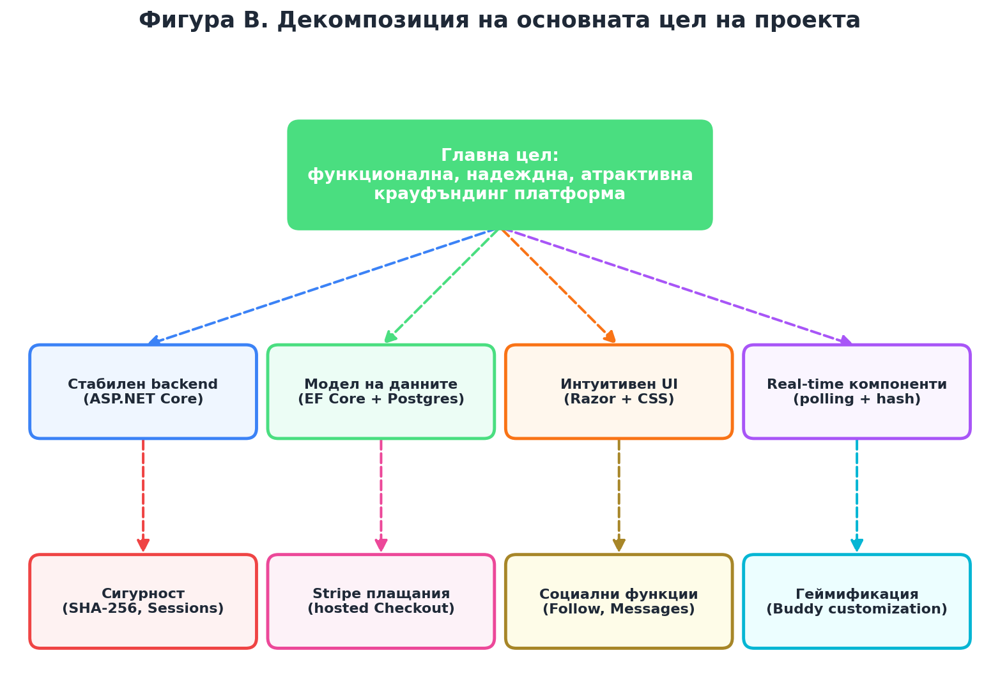{ width=15cm }

**Фигура I.1 – Декомпозиция на основната цел на проекта**

Постигането на тази обща цел се разделя на няколко по-специфични под-цели. Първата е създаване на стабилен backend, базиран на ASP.NET Core, който да поема всички заявки от потребителите, да валидира входните данни и да управлява живота на сесиите. Втората под-цел е изграждане на модел на данните, който да описва основните обекти в системата – потребители, кампании, дарения и актуализации – и да позволява лесно разширяване в бъдеще. Третата под-цел е разработването на потребителски интерфейс, който да бъде едновременно интуитивен за нови потребители и достатъчно богат на функционалности за по-напреднали посетители на платформата. Четвъртата под-цел е реализиране на real-time функционалности, които да създават усещане за живо, активно използване на платформата – например показване на текущата статистика на дарения за деня, средната стойност на дарение и брой активни кампании.

В по-широк план, целта на проекта е да се демонстрира как съвременните технологии за уеб разработка могат да се използват за решаване на реални проблеми в обществото. Крауфъндингът е инструмент, който предоставя подкрепа на хора, идеи и каузи, които иначе биха останали без финансиране. KryskataFund се стреми да докаже, че подобна платформа може да бъде изградена с относително ограничени ресурси, при условие че се използват подходящите технологии и се следват утвърдените архитектурни модели в индустрията.

## 1.4. Очаквания

При разработката на проекта се поставят няколко основни очаквания. Преди всичко се очаква финалното приложение да бъде функционално напълно, тоест всички основни сценарии на употреба да могат да бъдат изпълнени без грешки. Това включва успешна регистрация на нов потребител, безпроблемен вход в системата, създаване на нова кампания с пълни детайли, разглеждане на кампания, извършване на дарение, публикуване на актуализация към собствена кампания и преглед на профилната страница.

Освен функционалните очаквания, има и нефункционални такива. Очаква се приложението да бъде отзивчиво и бързо, със време за зареждане на страниците, което не надвишава нормалните стандарти на индустрията. Очаква се също интерфейсът да бъде естетически приятен и съвременен, така че да оставя положително впечатление у потребителите още от първото им посещение. Допълнително се очаква кодът да бъде организиран и поддържаем, така че да позволява лесно бъдещо разширяване с нови функционалности, като например интеграция с платежни системи, изпращане на имейл известия, многоезична поддръжка и социални функции.

От практическа гледна точка, се очаква проектът да служи като качествен пример за това как се изгражда модерно уеб приложение в стека ASP.NET Core. Очаква се финалният резултат да демонстрира владеене както на основни концепции (контролери, изгледи, модели, бази данни), така и на по-напреднали теми като сесийно управление, хеширане на пароли, валидация на форми и динамично обновяване на съдържанието чрез JavaScript.

В дългосрочен план, едно от очакванията е проектът да може да бъде доразвит до напълно работещ онлайн продукт, който да обслужва реални крауфъндинг кампании. Това би изисквало интеграция с платежен оператор, внедряване на по-стриктни мерки за сигурност и хостинг в облачна среда, способна да обработва голям брой едновременни потребители. Проектът обаче още в настоящия си вид предоставя цялата необходима основа за подобно бъдещо разширяване.

## 1.5. Предизвикателства

Разработката на платформа от типа на KryskataFund включва множество технологични и проектантски предизвикателства, които трябва да бъдат разрешени по време на процеса. Тези предизвикателства, групирани по тематични области, са визуализирани на Фигура I.2. Те обхващат както чисто технически въпроси (избор на стек, real-time компоненти, транзакционна целостност), така и дизайнерски решения (UI/UX баланс, live preview), организационни аспекти (поддръжимост) и въпроси на сигурността.

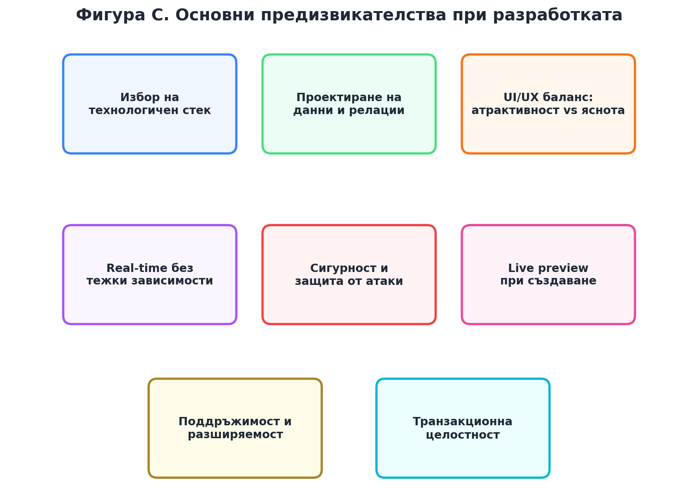{ width=14cm }

**Фигура I.2 – Основни предизвикателства при разработката на KryskataFund**

 Първото предизвикателство е свързано с правилния избор на технологичен стек. На пазара съществуват десетки рамки и езици за програмиране, всеки с различни предимства и недостатъци. Изборът на ASP.NET Core беше резултат от подробен анализ на изискванията към проекта – необходимостта от стабилност, силна типизация, зряла екосистема и възможност за бърза разработка.

Второто предизвикателство касае проектирането на модела на данните. Системата трябва да описва не просто отделни обекти като потребители и кампании, а сложните взаимоотношения помежду им – кой е създал коя кампания, кой е дарил към коя кампания, кои актуализации принадлежат на коя кампания и така нататък. Освен това моделът трябва да предвиди и бъдещи разширения, като например коментари към кампании, проследяване на потребители, нотификации и социални функции. Балансът между простота на текущия модел и възможност за разширяване в бъдеще беше постоянно предизвикателство.

Третото предизвикателство е свързано с потребителския интерфейс. От една страна интерфейсът трябва да изглежда модерно и атрактивно, с използване на тъмен дизайн, плавни анимации и интерактивни елементи. От друга страна обаче той трябва да остане ясен и разбираем дори за потребители, които не са технически грамотни. Намирането на правилния баланс между визуална атрактивност и функционална яснота беше едно от най-сложните решения по време на разработката.

Четвъртото предизвикателство е реализирането на функционалностите в реално време. Главната страница на платформата показва статистики, които се обновяват автоматично – брой активни кампании, общо набрани средства за деня, средна стойност на дарение и активен поток от събития. За да се реализира това поведение, без да се използват тежки технологии като SignalR, беше избран подход на периодично запитване (polling) с детекция на промени чрез хеш стойности, така че интерфейсът да не се пренаписва ненужно, ако няма реални промени.

Петото предизвикателство касае сигурността. Потребителските пароли не могат да се съхраняват в чист текст – те трябва да бъдат хеширани с надеждна криптографска функция. Сесиите трябва да бъдат защитени с HttpOnly бисквитки. Входните данни трябва да бъдат валидирани, за да се предотвратят атаки като SQL injection, cross-site scripting и cross-site request forgery. Всеки от тези аспекти изискваше подробно проучване и внедряване на подходящите мерки.

Шестото предизвикателство е свързано с потребителското изживяване по време на създаване на кампания. Формата за създаване включва множество полета – заглавие, описание, категория, целева сума, продължителност и изображение. За да се направи процесът по-приятен за потребителя, беше реализирана функционалност за live preview – докато потребителят попълва полетата, отдясно се показва как ще изглежда кампанията след нейното създаване. Това позволява веднага да се види крайният резултат и да се направят корекции преди финалното публикуване.

Седмото предизвикателство касае поддръжката и разширяването на проекта. Кодът трябва да бъде организиран по начин, който позволява на бъдещите разработчици бързо да се ориентират и да добавят нови функционалности. За тази цел беше използвана MVC архитектурата, бяха създадени отделни ViewModel-и за изгледите, ApplicationDbContext беше изграден като централна точка за достъп до базата данни, а изгледите бяха разделени на ясно структурирани директории.

---

# 2. Изложение

## 2.1. Проучвателна част

Преди започването на същинската разработка беше извършен детайлен анализ на пазара и съществуващите решения в областта на колективното финансиране. Целта на това проучване беше да се идентифицират най-добрите практики, утвърдените функционалности и най-значимите слабости на популярните платформи, така че KryskataFund да може да се позиционира като продукт, който избягва грешките на конкурентите и заимства най-успешните им елементи.

Колективното финансиране, известно още като краудфъндинг, е метод за набиране на парични средства чрез интернет, при който голям брой хора правят малки финансови вноски в полза на конкретен проект, идея или кауза. Този метод придоби изключителна популярност през последното десетилетие, тъй като предоставя възможности за финансиране, които традиционните банки и инвестиционни институции рядко биха подкрепили. Творчески, благотворителни и обществено значими проекти, които иначе биха останали без подкрепа, могат да намерят своята публика и финансиране именно чрез крауфъндинг платформи.

Съществуват няколко основни разновидности на крауфъндинг модела, представени графично на Фигура II.1. Първият е донейшън-базиран, при който дарителите не получават никаква материална награда срещу своята вноска, а единствено удовлетворението, че са подкрепили дадена кауза. Този модел е особено подходящ за благотворителни и обществени инициативи. Вторият е reward-базиран, при който дарителите получават някаква форма на материална награда – продукт, услуга, специално издание на даден артикул и подобни. Този модел е популярен сред творчески проекти, технологични стартъпи и независими автори. Третият модел е equity-базиран, при който дарителите получават дял от компанията или проекта, който подкрепят, и съответно се очаква в бъдеще да се възползват от потенциални печалби. Четвъртият модел е debt-базиран, при който вложените средства се връщат с лихва, подобно на заем.

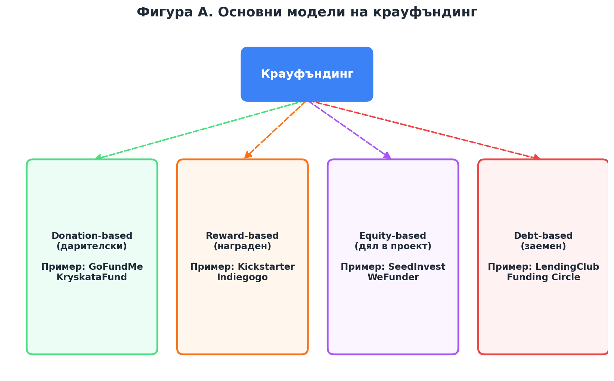{ width=15cm }

**Фигура II.1 – Основни модели на крауфъндинг и техните представители**

KryskataFund се фокусира основно върху донейшън-базирания модел, тъй като той е най-универсален и не изисква сложни правни рамки или интеграции с инвестиционни органи. Този модел е особено подходящ за платформи, насочени към обществени каузи, образователни инициативи и творчески проекти.

На световния пазар съществуват няколко утвърдени крауфъндинг платформи, всяка със своите силни и слаби страни. Kickstarter е една от най-известните, специализирана в творчески и иновационни проекти. Тя използва модела „всичко или нищо", при който събраните средства се изплащат на създателя само ако кампанията достигне поставената си цел. Този модел осигурява допълнителна сигурност за дарителите, тъй като те знаят, че парите им няма да бъдат пропилени, ако проектът не получи достатъчна подкрепа. От друга страна обаче, този подход е твърде ограничителен за по-малки и нишови проекти, които може да не достигнат целта си в срок, но все пак да получат полезна подкрепа.

GoFundMe е другата голяма платформа, която се фокусира предимно върху лични кампании, благотворителност и медицински нужди. За разлика от Kickstarter, тя позволява на създателя да задържи събраните средства независимо от това дали целта е достигната. Това я прави по-подходяща за спешни и хуманитарни ситуации, при които всяка събрана сума има стойност. Indiegogo е още една известна платформа, която предлага гъвкави модели на финансиране и е особено популярна сред технологичните иновации и стартъпите. Patreon е специфична платформа, която работи на абонаментен модел – подкрепящите плащат месечни или годишни вноски на любимите си автори в замяна на ексклузивно съдържание.

След проучването се идентифицираха няколко общи характеристики, които всички успешни крауфъндинг платформи притежават. Първо, всички те предоставят ясна и удобна форма за създаване на нова кампания, която включва заглавие, описание, изображение, цел и продължителност. Второ, всички предлагат страница за детайли на кампанията, на която се вижда напредъкът към целта, оставащото време и списък на дарителите. Трето, всички използват визуални елементи като прогрес ленти, проценти и брояци, за да направят информацията по-разбираема. Четвърто, всички предоставят възможност за публикуване на актуализации, чрез които създателят може да информира своите подкрепящи за развитието на проекта. Тези общи елементи бяха включени и в KryskataFund.

За да се обобщи извършеният анализ и за да се позиционира KryskataFund спрямо съществуващите решения, беше изготвена сравнителна таблица, която съпоставя ключовите функционалности на разгледаните платформи. Таблицата показва кои функции са общо приети в индустрията и в кои аспекти KryskataFund добавя стойност чрез комбинация от утвърдени и иновативни елементи.

| Характеристика | Kickstarter | GoFundMe | Indiegogo | Patreon | KryskataFund |
|---|---|---|---|---|---|
| Донейшън-базиран модел | Не | Да | Частично | Не | Да |
| Reward-базиран модел | Да | Не | Да | Да | Не |
| Live preview при създаване | Не | Не | Не | Не | Да |
| Прогрес лента и оставащи дни | Да | Да | Да | N/A | Да |
| Категории на кампании | Да | Да | Да | Не | Да |
| Актуализации към кампания | Да | Да | Да | Да | Да |
| Реалновременни статистики | Не | Не | Не | Не | Да |
| Активен поток от събития | Не | Не | Не | Не | Да |
| Персонализиран профилен аватар | Не | Не | Не | Частично | Да (Buddy) |
| Embed widget за външни сайтове | Не | Да | Не | Не | Да |
| Recurring (периодични) дарения | Не | Да | Не | Да | Да |
| Лични съобщения между потребителите | Не | Не | Не | Да | Да |
| Тъмна модерна тема по подразбиране | Не | Не | Не | Не | Да |
| Open source | Не | Не | Не | Не | Да |

**Таблица 1 – Сравнение на ключови характеристики на крауфъндинг платформи**

Таблицата ясно показва, че KryskataFund комбинира утвърдените функционалности на световните платформи (категории, актуализации, прогрес лента) с няколко уникални елемента, които са рядкост или липсват изцяло в конкурентните решения – live preview при създаване, реалновременни статистики, активен поток от събития, персонализиран Buddy аватар и embed widget за вграждане на кампании в чужди сайтове. Тази комбинация позиционира платформата като подходяща за съвременен потребител, който очаква едновременно лекота на използване и интерактивност.

Що се отнася до технологичния стек, преди започване на проекта бяха разгледани различни алтернативи. От страна на backend-а, основните разглеждани опции бяха ASP.NET Core, Node.js с Express, Django (Python) и Ruby on Rails. ASP.NET Core беше избран заради своята зряла екосистема, силна типизация чрез C#, отлична документация, висока производителност и възможност за работа на множество платформи. Node.js предлага по-кратък код, но липсата на статична типизация в стандартен JavaScript е недостатък при по-големи проекти. Django е отлична рамка, но Python не е сред основните езици, използвани в проекта. Ruby on Rails също беше изключен поради по-малката му популярност в българската индустрия и по-ограничената документация на български.

От страна на frontend-а, бяха разгледани опции като React.js, Vue.js, Angular и стандартни Razor Views с HTML/CSS/JavaScript. За проект с този мащаб беше преценено, че Razor Views в комбинация с малко количество vanilla JavaScript са напълно достатъчни. Това решение позволява да се запази леко и бързо приложение, без да се добавя сложността на отделен frontend проект. Освен това Razor Views се интегрират безпроблемно с останалата част на ASP.NET Core, което улеснява разработката.

За базата данни бяха разгледани SQLite, PostgreSQL и SQL Server. PostgreSQL беше избран заради зрелостта и широкото си използване в индустрията, високата производителност, отличната поддръжка от Entity Framework Core през доставчика Npgsql и удобството за хостване в облачни среди като Heroku, Render и Railway, които автоматично предоставят PostgreSQL чрез променливата на средата DATABASE_URL. SQLite беше разгледан като алтернатива за изключително бърза локална разработка, но беше отхвърлен в полза на единен production-ready стек.

## 2.2. Изисквания към програмния продукт

### 2.2.1. Поставени задачи

Задачите, поставени в началото на проекта, бяха формулирани в съответствие с принципите на итеративната разработка – първоначално се определят основните функционалности, които съставляват минимално жизнеспособен продукт (Minimum Viable Product), а след това постепенно се добавят допълнителни функционалности, които повишават качеството и привлекателността на платформата. Цялостният итеративен подход с петте фази на разработка е представен графично на Фигура II.2.

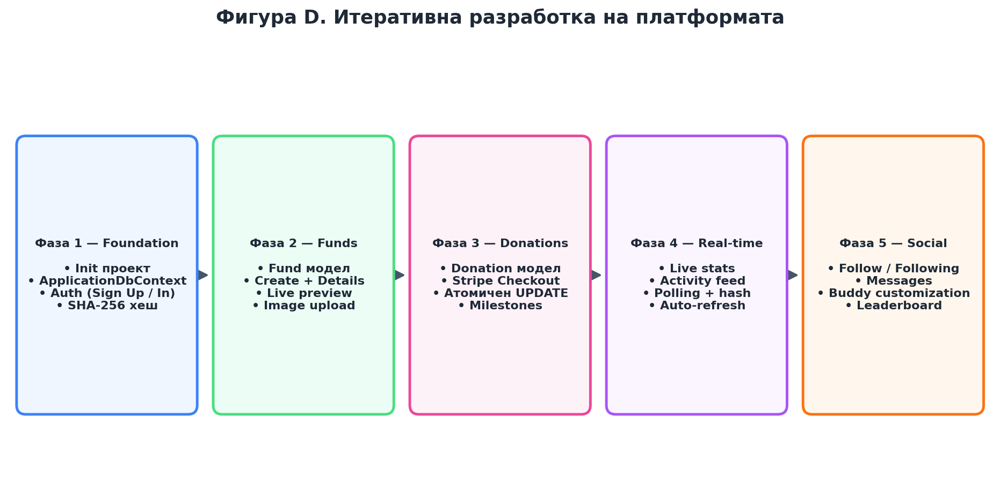{ width=15cm }

**Фигура II.2 – Итеративна разработка на платформата на пет фази**

Първоначалните задачи бяха формулирани като следват:

- Инициализация на ASP.NET Core MVC проект със стандартна структура на директориите, конфигуриране на Entity Framework Core и PostgreSQL база данни през доставчика Npgsql.
- Създаване на базова потребителска система, включваща регистрация, вход в системата и изход.
- Реализация на хеширане на пароли с надеждна криптографска функция.
- Внедряване на сесийно управление, така че влезлите потребители да могат да достъпват защитени страници.
- Създаване на модул за кампании – модели, контролери и изгледи за създаване, преглед и управление на кампании.
- Реализация на страница за създаване на нова кампания с функционалност за live preview.
- Внедряване на качване на изображения (по URL или като файл).
- Изграждане на главна страница, която показва списък с активни кампании и предоставя възможност за филтриране по категория.
- Реализация на детайлна страница за кампания, която показва пълно описание, прогрес към целта и списък с дарители.
- Реализация на функционалност за дарения, включително валидация на сумата и обновяване на статистиките на кампанията.
- Внедряване на функционалност за публикуване на актуализации към собствените кампании от страна на техните създатели.
- Изграждане на профилна страница, която включва персонализация на „buddy" персонаж.
- Внедряване на статистики в реално време – брой активни кампании, общо набрани средства, средна стойност на дарение и активен поток от събития.
- Подробно тестване на всички функционалности и отстраняване на евентуалните грешки.

Всички тези задачи бяха изпълнени успешно в рамките на разработката на проекта, а финалното приложение покрива пълния обхват на първоначално планираните функционалности.

### 2.2.2. Функционални изисквания

Функционалните изисквания към платформата описват какво конкретно трябва да прави приложението от потребителска гледна точка. За яснота и проследимост те са групирани по модули и номерирани по схемата Ф{група}.{подизискване}, така че всяко изискване да може да бъде ясно идентифицирано в по-нататъшните етапи на проектирането, реализацията и тестването.

#### Ф1: Регистрация и автентикация на потребители

- **Ф1.1:** Системата трябва да позволява регистрация на нови потребители чрез валиден имейл адрес и парола.
- **Ф1.2:** Имейл адресът трябва да бъде уникален – системата не позволява повторна регистрация със същия адрес.
- **Ф1.3:** Паролата трябва да бъде най-малко 6 символа, с изискване за поне една главна буква, една малка буква, една цифра и един специален символ.
- **Ф1.4:** Системата трябва да позволява вход с имейл и парола и да поддържа сесийно управление с idle timeout от 30 минути.
- **Ф1.5:** Системата трябва да съхранява паролите във форма на SHA-256 хеш и никога в чист текст.
- **Ф1.6:** Системата трябва да позволява изход (sign out), който прекратява сесията и я изчиства.
- **Ф1.7:** При успешна регистрация и вход потребителят се пренасочва автоматично към изисканата страница (returnUrl), ако има такава, или към главната страница.

#### Ф2: Управление на потребителски профил и Buddy персонализация

- **Ф2.1:** Системата трябва да предоставя профилна страница, която показва имейл, дата на регистрация, общо набрани средства от собствените кампании, общо дарени средства и брой подкрепени проекти.
- **Ф2.2:** Профилът трябва да съдържа визуален „buddy" персонаж, който потребителят може да персонализира чрез избор на очила, шапка и маска.
- **Ф2.3:** Промените в Buddy персонажа трябва да се записват автоматично в базата данни без необходимост от изрично натискане на бутон „Save".
- **Ф2.4:** Потребителят трябва да има достъп до отделни страници „My Funds" (моите кампании), „My Donations" (моите дарения) и „Following" (последвани кампании) от профила си.

#### Ф3: Създаване и управление на кампании

- **Ф3.1:** Само автентикираните потребители трябва да могат да създават нова кампания.
- **Ф3.2:** Формата за създаване трябва да включва задължителни полета: заглавие (до 200 символа), описание (минимум 50 символа), категория, целева сума (между €100 и €1 000 000) и продължителност в дни (между 1 и 90).
- **Ф3.3:** Системата трябва да позволява добавяне на заглавно изображение чрез URL или качване на файл от устройството.
- **Ф3.4:** При попълване на формата трябва да се показва live preview, който се обновява в реално време чрез JavaScript при всяка промяна на полетата.
- **Ф3.5:** Създателите на кампании трябва да могат да публикуват актуализации (FundUpdate) с заглавие и съдържание, които се показват в детайлната страница.
- **Ф3.6:** Създателите трябва да могат да дефинират междинни цели (FundMilestones), които се отбелязват автоматично като достигнати при набиране на съответната сума.
- **Ф3.7:** Създателите трябва да могат да добавят съавтори (FundCollaborators), които също могат да управляват кампанията.
- **Ф3.8:** Системата трябва да поддържа удължаване на крайния срок (DeadlineExtension) за определени случаи.

#### Ф4: Разглеждане на кампании

- **Ф4.1:** Главната страница трябва да показва всички активни кампании във вид на интерактивни карти с изображение, заглавие, категория, прогрес лента и оставащо време.
- **Ф4.2:** Системата трябва да позволява филтриране на кампаниите по категория чрез интерактивни бутони.
- **Ф4.3:** Детайлната страница на кампания трябва да показва пълно описание, прогрес към целта, оставащо време, списък с дарители, междинни цели и публикуваните актуализации.
- **Ф4.4:** Системата трябва да предоставя глобално търсене на кампании по заглавие чрез отделен SearchController.
- **Ф4.5:** Системата трябва да позволява вграждане на кампания в чужди сайтове чрез embed widget (страница `/Funds/Embed/{id}` без X-Frame-Options ограничения).

#### Ф5: Дарения и плащания

- **Ф5.1:** Само автентикираните потребители трябва да могат да правят дарения.
- **Ф5.2:** Страницата за дарение трябва да предлага бързи бутони с предварително дефинирани суми (5, 10, 25, 50, 100 EUR) и поле за персонализирана стойност.
- **Ф5.3:** Сумата трябва да бъде положителна и валидирана както от страна на клиента, така и от страна на сървъра.
- **Ф5.4:** Плащанията трябва да се обработват чрез Stripe Checkout – системата създава Stripe Checkout Session и пренасочва потребителя към сигурна страница за въвеждане на платежни данни.
- **Ф5.5:** При успешно плащане сесията на Stripe трябва да бъде верифицирана от страна на сървъра (`PaymentStatus == "paid"`) преди записването на дарението.
- **Ф5.6:** Записването на дарение и обновяването на статистиките на кампанията трябва да се извършват в обща транзакция, като се използва атомична SQL заявка (`UPDATE ... SET RaisedAmount = RaisedAmount + ...`) за избягване на race conditions при конкурентни дарения.
- **Ф5.7:** Системата трябва да поддържа recurring (периодични) дарения, които потребителите могат да активират и отменят от профила си.
- **Ф5.8:** При достигане на междинна цел (milestone) тя трябва да се отбележи автоматично като достигната в същата транзакция.

#### Ф6: Реалновременни статистики и activity feed

- **Ф6.1:** Главната страница трябва да показва статистики в реално време: общо набрани средства, брой активни кампании (Live Campaigns), общо дарения за днес (Today's Impact) и средна стойност на дарение (Avg. Support).
- **Ф6.2:** Стойностите трябва да се обновяват автоматично през endpoint `/Home/GetLiveStats` без презареждане на страницата.
- **Ф6.3:** Активният поток от събития (activity feed) трябва да показва последните 5 събития от платформата – нови дарения, нови кампании и достигнати междинни цели.
- **Ф6.4:** Обновяването трябва да се извършва периодично (polling) с детекция на промени, за да се избягват ненужни DOM операции при липса на нови данни.

#### Ф7: Социални функции

- **Ф7.1:** Автентикираните потребители трябва да могат да последват (follow) кампании, които ги интересуват.
- **Ф7.2:** Системата трябва да предоставя страница „Following" с всички последвани кампании.
- **Ф7.3:** Потребителите трябва да могат да изпращат лични съобщения помежду си чрез вграден messaging модул с inbox и conversation страници.
- **Ф7.4:** Непрочетените съобщения трябва да бъдат визуално отличими от прочетените.

#### Ф8: Leaderboard

- **Ф8.1:** Системата трябва да предоставя leaderboard страница с топ 10 кампании по набрани средства, топ 10 дарители по обща сума и топ 10 създатели по успех.
- **Ф8.2:** Leaderboard страницата трябва да показва общи статистики на платформата – общ брой кампании, общ брой дарения, общ брой потребители.

#### Ф9: Административен панел

- **Ф9.1:** Административният панел трябва да е достъпен само за потребители с маркер `IsAdmin`.
- **Ф9.2:** Таблото трябва да показва обобщена статистика – общ брой потребители, общ брой кампании, общ обем дарения и последните регистрации.
- **Ф9.3:** Администраторът трябва да може да преглежда списъка с потребители, да променя ролите им и да изтрива потребители при необходимост.
- **Ф9.4:** Администраторът трябва да може да управлява кампаниите – да ги верифицира (`IsVerified`), да ги маркира като неактивни или да ги изтрива.

### 2.2.3. Нефункционални изисквания

Нефункционалните изисквания описват качествените характеристики на приложението, които не са свързани директно с конкретна функционалност, но влияят значително върху общото потребителско изживяване и техническата надеждност. И тук е възприета номерационна схема НФ{група}.{подизискване}, която прави всяко изискване еднозначно проследимо.

#### НФ1: Производителност

- **НФ1.1:** Времето за зареждане на която и да е страница не трябва да надвишава 3 секунди при стандартна интернет връзка.
- **НФ1.2:** Заявките за live статистики и activity feed трябва да отговарят за под 500 ms при средна натовареност.
- **НФ1.3:** Обновяването на статистиките чрез polling не трябва да причинява пренаписване на DOM, ако данните не са се променили (детекция чрез сравнение).
- **НФ1.4:** Заявките към базата данни трябва да бъдат оптимизирани чрез използване на индекси и LINQ проекции.

#### НФ2: Сигурност

- **НФ2.1:** Паролите трябва да се съхраняват като SHA-256 хешове чрез системната криптографска библиотека (`System.Security.Cryptography.SHA256`).
- **НФ2.2:** Сесийните бисквитки трябва да бъдат маркирани като `HttpOnly`, `IsEssential` и `SameSite=Strict`, за да се предотвратят XSS и CSRF атаки.
- **НФ2.3:** Всички SQL заявки трябва да бъдат параметризирани (чрез EF Core или `ExecuteSqlRawAsync` с параметри), за да се предотвратят SQL injection атаки.
- **НФ2.4:** Платежните данни (номер на карта, CVV) не трябва да преминават през сървъра на приложението – обработват се изцяло от Stripe Checkout на хостваната Stripe страница.
- **НФ2.5:** Stripe Secret Key трябва да се съхранява в `appsettings` или средова променлива и никога да не се ангажира в Git.
- **НФ2.6:** Административните функции трябва да бъдат достъпни само за потребители с маркер `IsAdmin`.
- **НФ2.7:** В продукционна среда трябва да бъде активиран HSTS (HTTP Strict Transport Security).

#### НФ3: Надеждност

- **НФ3.1:** Записването на дарение и обновяването на статистиките на кампанията трябва да се извършват в обща транзакция, за да се запази консистентността на данните.
- **НФ3.2:** При едновременни дарения към една кампания не трябва да възниква race condition – трябва да се използва атомична SQL заявка за обновяване на сумата.
- **НФ3.3:** При провал на Stripe сесия системата трябва да върне потребителя обратно в детайлната страница на кампанията без записване на дарение.
- **НФ3.4:** Системата трябва да поддържа graceful degradation при липса на интернет свързаност – локално-кеширани ресурси трябва да продължават да работят.

#### НФ4: Използваемост

- **НФ4.1:** Потребителският интерфейс трябва да следва съвременен тъмен (dark mode) дизайн с висок контраст.
- **НФ4.2:** Интерфейсът трябва да бъде responsive – работи коректно на десктоп, таблет и мобилен телефон.
- **НФ4.3:** Бутоните, формите и съобщенията за грешки трябва да бъдат ясно видими и интуитивни.
- **НФ4.4:** Системата трябва да предоставя персонализирани страници за грешки за HTTP 403, 404 и 500.
- **НФ4.5:** Анимациите и преходите трябва да бъдат плавни (60 fps) и да не пречат на ползваемостта при потребители с ниски системни изисквания.

#### НФ5: Поддръжка и разширяемост

- **НФ5.1:** Кодът трябва да следва MVC архитектурния модел за ясно разделение на отговорностите.
- **НФ5.2:** Зависимостите трябва да се инжектират чрез вградения Dependency Injection контейнер на ASP.NET Core.
- **НФ5.3:** ApplicationDbContext трябва да бъде единствената точка за достъп до базата данни – директни SQL заявки през ADO.NET са забранени.
- **НФ5.4:** Сервизният слой (FundService, DonationService, UserService) трябва да капсулира бизнес логиката извън контролерите за по-добра тестваемост.
- **НФ5.5:** Конфигурационните параметри (connection string, Stripe ключове) трябва да се управляват чрез `appsettings.json` и средови променливи.

#### НФ6: Преносимост и инфраструктура

- **НФ6.1:** Приложението трябва да може да се стартира на Windows, macOS и Linux без промени в кода.
- **НФ6.2:** Базата данни трябва да поддържа както локален PostgreSQL, така и managed PostgreSQL в облачна среда (Heroku, Render, Railway) чрез средовата променлива `DATABASE_URL`.
- **НФ6.3:** Приложението трябва да позволява тестване с InMemory database provider (за unit тестове), без промени в основния код – откриване на InMemory доставчика чрез `_context.Database.ProviderName`.
- **НФ6.4:** Връзката с PostgreSQL в облака трябва да поддържа SSL Mode=Require и Trust Server Certificate=true.

### 2.2.4. Случаи на употреба

В този раздел са описани основните случаи на употреба (use cases), които илюстрират сценариите на взаимодействие между потребителите и системата. Всеки случай съдържа актьора (типа потребител), предусловието, основния сценарий и възможните алтернативни сценарии. Тези случаи на употреба се основават на дефинираните функционални изисквания и образуват база за тестване на крайния продукт.

Системата разпознава четири основни типа потребители (актьори), всеки със своя специфична роля и набор от функционалности. Връзките между тези актьори и платформата са визуализирани на Фигура II.3.

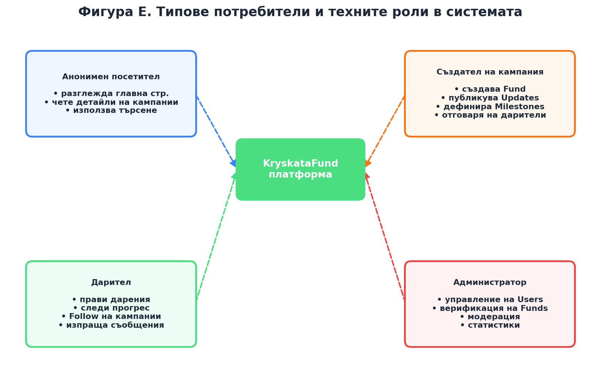{ width=15cm }

**Фигура II.3 – Типове потребители и техните роли в KryskataFund**

#### Случай на употреба 1: Регистрация на нов потребител

- **Актьор:** Нерегистриран посетител
- **Предусловие:** Потребителят е на главната страница и още не разполага с профил
- **Основен сценарий:**
  1. Потребителят натиска бутона „Sign Up" в навигационната лента.
  2. Системата показва формуляра за регистрация с полета имейл, парола и потвърждение на парола.
  3. Потребителят попълва полетата и натиска „Create Account".
  4. Системата валидира входните данни (формат, дължина, сложност) и проверява дали имейлът вече не съществува.
  5. Системата хешира паролата с SHA-256, създава нов запис в таблицата `Users` и автоматично инициира сесия.
  6. Потребителят е пренасочен към главната страница като автентикиран потребител.
- **Алтернативен сценарий А (имейл вече съществува):** Системата показва съобщение „An account with this email already exists" и потребителят остава на формата.
- **Алтернативен сценарий Б (валидация се проваля):** Системата показва съответните грешки до всяко поле без да създава запис.

#### Случай на употреба 2: Създаване на нова кампания

- **Актьор:** Автентикиран потребител
- **Предусловие:** Потребителят е влязъл и е натиснал „Make a fund" в навигационната лента
- **Основен сценарий:**
  1. Системата показва формуляра за създаване на кампания, разделен на форма отляво и live preview отдясно.
  2. При всяка промяна в полетата JavaScript обновява preview-то в реално време.
  3. Потребителят попълва задължителните полета (заглавие, описание, категория, целева сума, продължителност) и опционално качва изображение.
  4. Потребителят натиска „Create Campaign".
  5. Системата валидира всички полета чрез Data Annotations върху `CreateFundViewModel`.
  6. При качване на файл системата записва изображението в `wwwroot/uploads/` под уникално име (Guid).
  7. Системата създава нов запис в таблицата `Funds` с автоматично присвоен цвят на категорията и крайна дата (`CreatedAt + DurationDays`).
  8. Потребителят е пренасочен към детайлната страница на новосъздадената кампания.
- **Алтернативен сценарий А (липсва изображение):** Системата изисква поне URL или качен файл; в противен случай показва грешка.
- **Алтернативен сценарий Б (валидация се проваля):** Системата запазва въведените данни и показва грешките до съответните полета.

#### Случай на употреба 3: Дарение към кампания през Stripe

- **Актьор:** Автентикиран потребител (дарител)
- **Предусловие:** Потребителят е на детайлната страница на активна кампания
- **Основен сценарий:**
  1. Потребителят натиска бутона „Donate" и избира предефинирана сума или въвежда персонализирана.
  2. Системата извиква action `CreateCheckoutSession`, който създава Stripe Checkout Session с подходящи `LineItems` и URL-и за успех/отказ.
  3. Потребителят е пренасочен към хостваната Stripe страница и въвежда платежни данни.
  4. След потвърждение от Stripe потребителят е пренасочен към `DonationSuccess` action с `session_id`.
  5. Системата верифицира сесията със Stripe (`session.PaymentStatus == "paid"`) и проверява за дублирано записване.
  6. В рамките на транзакция системата създава запис в `Donations`, обновява атомично `RaisedAmount` и `SupportersCount` чрез raw SQL и маркира евентуални достигнати междинни цели.
  7. Потребителят е пренасочен обратно към детайлната страница, където новото дарение е отразено.
- **Алтернативен сценарий А (платежен провал):** Системата хваща `StripeException` и пренасочва без записване на дарение.
- **Алтернативен сценарий Б (отказ от страна на потребителя):** Stripe пренасочва към `CancelUrl` и системата не записва нищо.

#### Случай на употреба 4: Публикуване на актуализация към собствена кампания

- **Актьор:** Създател на кампания (или съавтор)
- **Предусловие:** Потребителят е на детайлната страница на собствена кампания
- **Основен сценарий:**
  1. Потребителят натиска бутона „Post Update".
  2. Системата показва форма със заглавие и съдържание.
  3. Потребителят попълва полетата и натиска „Publish".
  4. Системата проверява, че текущият потребител е създател или съавтор (`IsCreatorOrCollaborator`).
  5. Системата създава нов запис в `FundUpdates` и пренасочва обратно към детайлната страница.
  6. Актуализацията се показва най-горе в раздела „Updates".
- **Алтернативен сценарий (потребителят не е създател):** Системата отказва публикуването с грешка „Only the fund creator can post updates".

#### Случай на употреба 5: Преглед на реалновременни статистики

- **Актьор:** Произволен посетител (включително неавтентикиран)
- **Предусловие:** Потребителят е на главната страница
- **Основен сценарий:**
  1. JavaScript на страницата стартира periodic polling към `/Home/GetLiveStats` на всеки 5 секунди.
  2. Сървърът връща JSON с текущите стойности на „Today's Impact" и „Avg. Support".
  3. Клиентът сравнява новите стойности с предишните и обновява DOM само ако има разлика.
  4. Паралелно се прави polling към `/Home/GetRecentActivity`, който връща последните 5 събития.
  5. Activity feed се обновява плавно с CSS transition при добавяне на нови елементи.
- **Алтернативен сценарий (грешка при заявката):** Клиентът игнорира грешката и опитва отново след следващия интервал, без да прекъсва UI-то.

#### Случай на употреба 6: Управление на платформата от администратор

- **Актьор:** Администратор (потребител с `IsAdmin = true`)
- **Предусловие:** Администраторът е влязъл и е навигирал до `/Admin/Dashboard`
- **Основен сценарий:**
  1. Системата проверява `IsAdmin` маркера от сесията преди да зареди таблото.
  2. Таблото показва обобщена статистика – брой потребители, брой кампании, общ обем дарения.
  3. Администраторът преглежда списъци с потребители и кампании.
  4. Администраторът може да верифицира кампания (`IsVerified = true`), да промени роля на потребител или да изтрие запис.
- **Алтернативен сценарий (неоторизиран достъп):** Системата пренасочва към 403 страница за грешка.

### 2.2.5. Модел на данните

Системата използва четири основни обекта (entity), всеки от които съответства на отделна таблица в базата данни. Връзките между тях се описват чрез чужди ключове, които осигуряват референциалната цялост на данните.

**Потребител (User).** Този обект описва регистриран потребител на платформата. Основните негови полета са уникален идентификатор, имейл адрес (уникален в системата), хеш на паролата, дата на регистрация и три полета за персонализация на buddy персонажа – избрани очила, шапка и маска. Имейл адресът се използва както за вход в системата, така и като основен идентификатор на потребителя пред останалите потребители. Хешът на паролата се съхранява в защитен формат, така че дори при евентуален пробив в базата данни, оригиналните пароли да не могат да бъдат възстановени.

**Кампания (Fund).** Този обект описва крауфъндинг кампания. Основните негови полета са уникален идентификатор, заглавие, описание, категория, целева сума, събрана сума, брой дарители, идентификатор на създателя, име на създателя, URL на изображение, дата на създаване, крайна дата и цвят на категорията. Допълнително обектът има изчислими полета (computed properties), които не се съхраняват в базата данни, но се изчисляват динамично – оставащи дни до края на кампанията и процент на изпълнение спрямо целта.

**Дарение (Donation).** Този обект описва индивидуално дарение към кампания. Основните му полета са уникален идентификатор, идентификатор на кампанията, идентификатор на дарителя, име на дарителя, сума на дарението и дата. Връзката с кампанията се осъществява чрез чужд ключ, така че при изтриване на кампания да могат да се изтрият или каскадно да се актуализират свързаните дарения.

**Актуализация на кампания (FundUpdate).** Този обект описва публикувана актуализация към кампания. Полетата му са уникален идентификатор, идентификатор на кампанията, заглавие, съдържание и дата на публикуване. Само създателят на кампанията може да публикува актуализации към нея.

Подробната структура на основните таблици е представена в Таблица 1, Таблица 2, Таблица 3 и Таблица 4.

**Таблица 1 – User (Потребител):**

| Поле | Тип | Описание |
|------|-----|----------|
| Id | int | Уникален идентификатор (PK) |
| Email | string | Имейл адрес (уникален индекс) |
| PasswordHash | string | SHA-256 хеш на паролата |
| CreatedAt | DateTime | Дата на регистрация |
| IsAdmin | bool | Маркер за администратор |
| BuddyGlasses | string? | Избрани очила за buddy |
| BuddyHat | string? | Избрана шапка за buddy |
| BuddyMask | string? | Избрана маска за buddy |

**Таблица 2 – Fund (Кампания):**

| Поле | Тип | Описание |
|------|-----|----------|
| Id | int | Уникален идентификатор (PK) |
| Title | string(200) | Заглавие на кампанията |
| Description | string | Описание |
| Category | string | Категория |
| GoalAmount | decimal | Целева сума |
| RaisedAmount | decimal | Събрана сума (default 0) |
| SupportersCount | int | Брой дарители |
| CreatorId | int | ID на създателя (FK) |
| CreatorName | string | Име на създателя |
| ImageUrl | string? | URL на изображението |
| CreatedAt | DateTime | Дата на създаване |
| EndDate | DateTime | Крайна дата |
| CategoryColor | string | HEX цвят на категорията |
| IsVerified | bool | Маркер за верификация |
| DaysLeft | computed | Оставащи дни (NotMapped) |
| ProgressPercent | computed | Процент изпълнение (NotMapped) |

**Таблица 3 – Donation (Дарение):**

| Поле | Тип | Описание |
|------|-----|----------|
| Id | int | Уникален идентификатор (PK) |
| FundId | int | ID на кампанията (FK) |
| UserId | int? | ID на дарителя (FK, nullable) |
| DonorName | string | Име на дарителя ("Anonymous" по подразбиране) |
| Amount | decimal | Сума на дарението |
| CreatedAt | DateTime | Дата на дарението |

**Таблица 4 – FundUpdate (Актуализация на кампания):**

| Поле | Тип | Описание |
|------|-----|----------|
| Id | int | Уникален идентификатор (PK) |
| FundId | int | ID на кампанията (FK) |
| Title | string | Заглавие на актуализацията |
| Content | string | Съдържание |
| CreatedAt | DateTime | Дата на публикуване |

Тези четири обекта формират ядрото на модела на данните и покриват всички основни функционалности на платформата. Освен тях системата поддържа и допълнителни таблици за разширените функционалности – UserFollow (последователи), FundMilestone (междинни цели), DeadlineExtension (удължаване на срок), FundCollaborator (съавтори на кампания), RecurringDonation (периодични дарения) и Message (лични съобщения). При евентуални бъдещи разширения могат да се добавят допълнителни обекти – коментари, нотификации и социални събития.

Графично представяне на основните обекти и техните връзки е дадено на ER диаграмата на Фигура 1. Всеки правоъгълник представлява таблица в базата данни, а стрелките показват кардиналността на връзките между тях (един към много, един към един и т.н.).

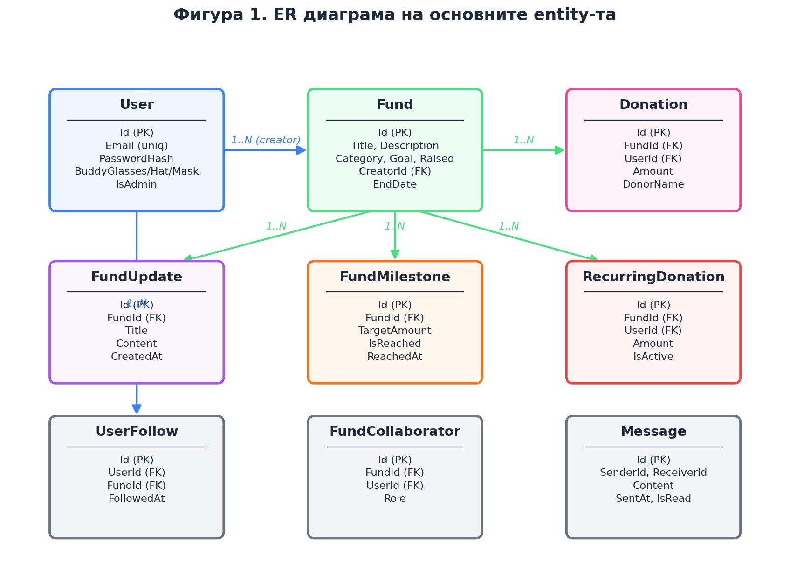{ width=16cm }

**Фигура 1 – Entity-Relationship диаграма на базата данни на KryskataFund**

## 2.3. Същинска част на проекта

### 2.3.1. Архитектура на приложението

Архитектурата на KryskataFund е изградена в съответствие с класическия Model-View-Controller (MVC) шаблон, който е стандарт в съвременната уеб разработка. Този шаблон разделя приложението на три основни слоя, всеки от които има ясно дефинирана отговорност и не се намесва в работата на останалите. Това разделение позволява лесна поддръжка и разширяване на приложението, тъй като промените в един слой обикновено не изискват промени в останалите.

Слоят Model описва бизнес обектите и логиката на приложението. В KryskataFund това включва обекти като User, Fund, Donation и FundUpdate, както и техните взаимоотношения. Моделът е независим от потребителския интерфейс и от начина, по който се представят данните – той просто описва какво съществува в системата и как се променя във времето.

Слоят View отговаря за представянето на данните пред потребителя. Това са Razor шаблоните, които генерират HTML страниците, които потребителят вижда в своя браузър. Изгледите получават данните от контролерите чрез ViewModels или директно през ViewBag, и не съдържат бизнес логика – те просто визуализират подадените им данни в подходящ формат.

Слоят Controller действа като посредник между Model и View. Той приема заявките от потребителя (HTTP заявки), извършва необходимите операции върху моделите (например запис в базата данни) и след това предава съответния изглед, който да бъде върнат на потребителя. KryskataFund има няколко основни контролера – HomeController отговаря за главната страница и общите функционалности, AccountController се занимава с потребителската система, FundsController обработва кампаниите и свързаните с тях операции.

Между слоя Model и базата данни се намира Entity Framework Core – обектно-релационен преобразувател (ORM), който превежда заявките към моделите в SQL заявки и обратно. Това позволява на разработчика да работи с обекти на C# и да оставя на рамката грижата за тяхното превръщане в редове и колони от базата данни. ApplicationDbContext е централният клас, който описва всички DbSet-ове, представляващи отделните таблици.

Цялостната архитектура на приложението е представена графично на Фигура 2.

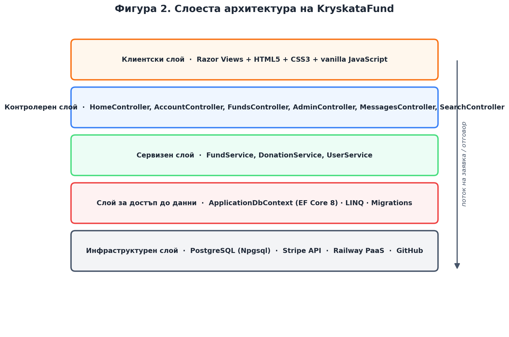{ width=15cm }

**Фигура 2 – Архитектурна диаграма на платформата KryskataFund**

Жизненият цикъл на всяка HTTP заявка преминава през няколко последователни етапа в ASP.NET Core конвейера – routing, изпълнение на action метод в съответния контролер, заявка към моделите чрез Entity Framework Core, и накрая рендиране на изгледа в HTML, който се връща на браузъра. Тази последователност е илюстрирана на Фигура 3.

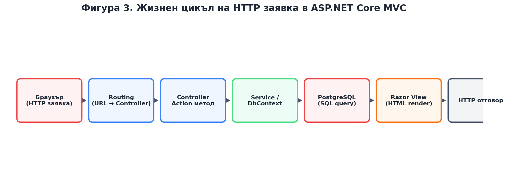{ width=15cm }

**Фигура 3 – Жизнен цикъл на HTTP заявка в ASP.NET Core MVC**

Стартирането и конфигурирането на цялата тази архитектура е централизирано във файла `Program.cs`. В него се регистрират необходимите услуги в Dependency Injection контейнера, конфигурира се connection string за базата данни, добавят се middleware-и в HTTP конвейера и се определя routing шаблонът. Кодът на Фигура 4 показва основните моменти от тази конфигурация:

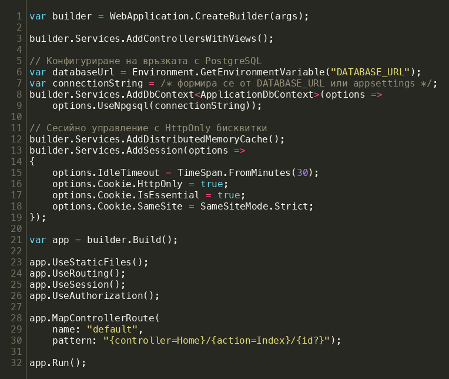

**Фигура 4 – Основна конфигурация на приложението в Program.cs**

### 2.3.2. Модул за потребители

Модулът за потребители реализира всички функционалности, свързани с регистрация, вход и управление на потребителския профил. Той се състои от модел User, контролер AccountController и няколко изгледа – SignIn, SignUp и Profile.

При регистрация на нов потребител, AccountController първо валидира входните данни – проверява дали имейл адресът е във валиден формат, дали паролата отговаря на минималните изисквания и дали имейл адресът вече не съществува в базата данни. Ако валидацията премине успешно, паролата се хешира с надежден алгоритъм, новият потребител се създава в базата данни и автоматично се влиза в системата чрез задаване на сесия.

При вход в системата, AccountController търси потребителя по имейл адрес в базата данни. Ако такъв потребител съществува, неговият хеш на паролата се сравнява с хешираната стойност на въведената парола. Ако сравнението е успешно, се създава нова сесия с идентификатора на потребителя, и той получава достъп до защитените страници.

Профилната страница показва информация за потребителя, включително неговия персонализиран buddy персонаж. Buddy е визуален аватар, който потребителят може да персонализира чрез избор на различни аксесоари – очила, шапка и маска. При избор на нов аксесоар, информацията се записва в базата данни и интерфейсът се обновява автоматично.

Кодът на Фигура 5 показва съкратена версия на метода за вход в системата от AccountController, който илюстрира работата със сесии и проверката на хеша на паролата:

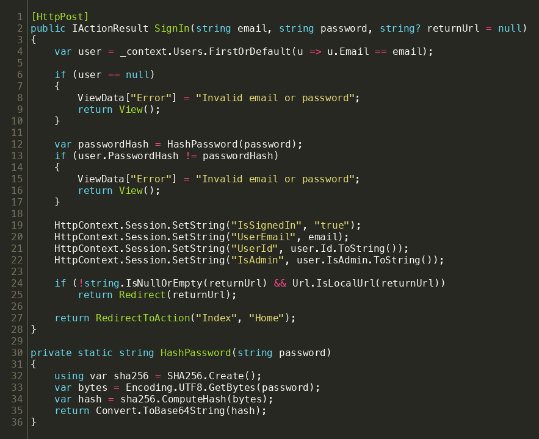

**Фигура 5 – Метод SignIn и помощна функция за хеширане на пароли**

Целият поток на удостоверяване, от въвеждането на email и парола от страна на потребителя до създаването на сесия и пренасочването към исканата страница, е представен на блок-схемата на Фигура 6. Тя илюстрира двете последователни проверки – съществува ли потребителят с дадения email и съвпада ли хешът на паролата – и съответните им разклонения в случай на грешка или успех.

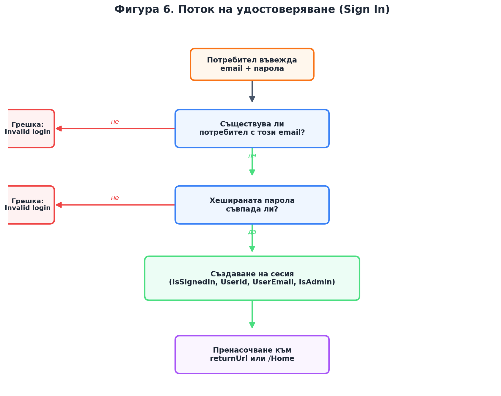{ width=15cm }

**Фигура 6 – Поток на удостоверяване (Sign In / Sign Up)**

### 2.3.3. Модул за кампании

Модулът за кампании е централна част от платформата и реализира пълен жизнен цикъл на крауфъндинг кампания – от нейното създаване, през публикуването, до управлението и накрая приключването. Този модул е реализиран чрез модела Fund, контролерa FundsController и няколко изгледа – Create, Details и Donate.

При създаване на нова кампания, потребителят попълва форма, която включва множество полета. Заглавието и описанието описват какво представлява кампанията. Категорията се избира от списък с предварително дефинирани опции – Education, Health, Animals, Creative, Dreams, Just for fun, Technology и Community. Целевата сума определя колко средства иска да събере създателят. Продължителността в дни определя кога ще приключи кампанията. Допълнително може да се качи изображение, което да представи кампанията визуално.

Една от особеностите на формата за създаване на кампания е функционалността за live preview. Докато потребителят попълва полетата, отдясно на формата се показва как ще изглежда кампанията след нейното създаване. Това позволява веднага да се види крайният резултат и да се направят корекции преди финалното публикуване. Реализацията на тази функционалност е изцяло базирана на JavaScript, който следи промените в полетата и обновява динамично preview-то.

Детайлната страница на кампанията показва пълна информация за нея – заглавие, изображение, описание, категория, прогрес към целта, оставащо време и списък с дарители. Освен това на тази страница се показват и публикуваните актуализации към кампанията, ако има такива. Бутонът за дарение е видимо разположен и води към отделна страница за дарение.

Валидацията на полетата във формата за създаване на кампания е имплементирана чрез Data Annotations върху ViewModel класа. Това позволява автоматично проверяване на входните данни както от страна на сървъра, така и от страна на клиента чрез jQuery Validation. Кодът на Фигура 7 показва модела `CreateFundViewModel`:

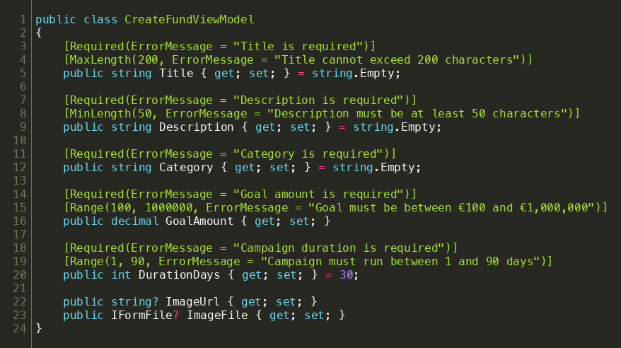

**Фигура 7 – CreateFundViewModel с Data Annotations за валидация**

Самият модел `Fund`, който описва кампанията в базата данни, съдържа както редовни поля, така и две изчислими полета (`DaysLeft` и `ProgressPercent`), маркирани с атрибута `[NotMapped]`, тъй като те се изчисляват динамично и не се съхраняват в базата. Кодът е представен на Фигура 8:

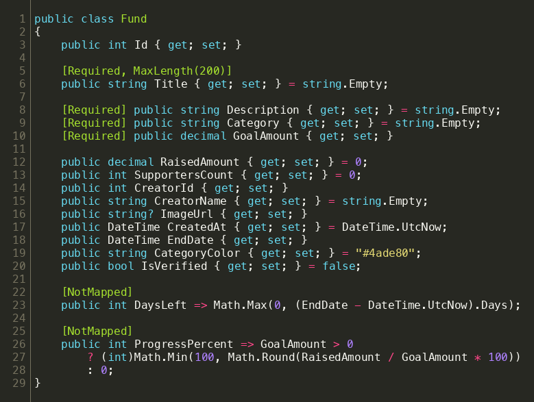

**Фигура 8 – Моделът Fund с computed свойства**

### 2.3.4. Модул за дарения

Модулът за дарения реализира централната функционалност на крауфъндинг платформата – процеса на финансиране на дадена кампания. Той е изграден около модела `Donation` и съответните action методи в `FundsController`, като интегрира външния платежен провайдър Stripe чрез официалната .NET библиотека `Stripe.net`. От архитектурна гледна точка модулът покрива няколко важни задачи едновременно: безопасна обработка на платежни данни, транзакционна гаранция за консистентност, защита от race conditions при едновременни дарения и проследяване на междинни цели.

#### Защо Stripe и hosted Checkout

Платежните данни на потребителите никога не преминават през сървъра на KryskataFund. Вместо това приложението използва Stripe Checkout – хоствано от Stripe платежно решение, при което потребителят е пренасочен към сигурна страница на Stripe, въвежда платежните си данни там, и след успешно плащане е пренасочен обратно с уникален `session_id`. Този подход освобождава приложението от тежестта на PCI DSS съответствие и значително намалява риска от компрометиране на чувствителни данни. Кодът на Фигура 9 показва как се създава Stripe Checkout Session:

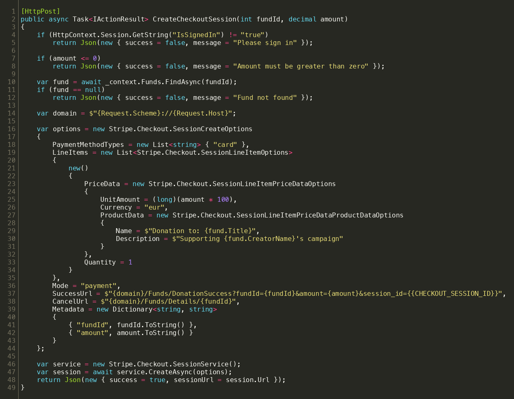

**Фигура 9 – Създаване на Stripe Checkout Session в FundsController**

Сумата се конвертира в най-малката валутна единица (центове) чрез умножение по 100, тъй като Stripe API изисква целочислена стойност. Полето `Metadata` запазва идентификатора на кампанията и сумата, така че те да могат да бъдат възстановени при последваща верификация. URL за успех включва специалния token `{CHECKOUT_SESSION_ID}`, който Stripe замества с реалния идентификатор при пренасочването.

#### Транзакционна защита и атомично обновяване

След успешно плащане Stripe пренасочва потребителя към `DonationSuccess` action с `session_id`. Системата първо верифицира сесията със Stripe (проверява `PaymentStatus == "paid"`), след това проверява за дублирано записване (защита срещу повторни презареждания на страницата), и накрая записва дарението и обновява статистиките на кампанията. Целият този процес е обвит в транзакция, за да се запази консистентността при произволно прекъсване. Кодът на Фигура 10 показва ключовия фрагмент:

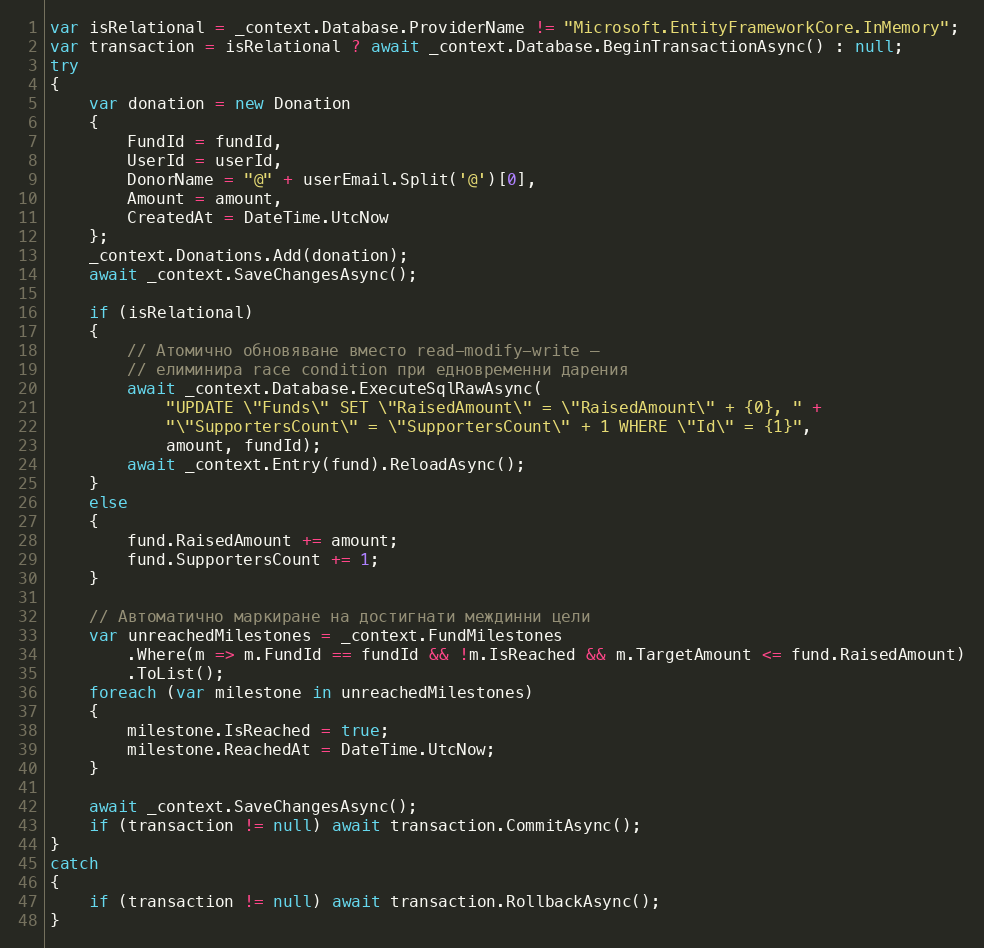

**Фигура 10 – Транзакционно записване на дарение с атомично обновяване и проверка за milestones**

Този подход решава едновременно няколко проблема. Първо, използването на raw SQL заявка `UPDATE ... SET RaisedAmount = RaisedAmount + ...` е атомична операция на ниво база данни – дори при сто едновременни дарения, всяко от тях ще добави своя принос към общата сума без да се загуби. Това е значително по-надеждно от класическия подход на „прочитане на текущата стойност в C#, добавяне в паметта, запис обратно", който води до race conditions. Второ, цялата операция е обвита в транзакция, така че при произволна грешка (например прекъсване на връзката с базата) всички промени се отменят. Трето, проверката `_context.Database.ProviderName != "Microsoft.EntityFrameworkCore.InMemory"` позволява модулът да работи и с InMemory database provider за unit тестване, без да изисква реална релационна база.

#### История на дарения и обратна връзка

История на дарения за дадена кампания се показва в детайлната страница под формата на списък с имена и суми, сортиран в обратен хронологичен ред. Това позволява на потенциалните дарители да видят социалното доказателство (social proof) на кампанията – колко души вече са допринесли и в какъв размер – което психологически насърчава нови дарения. Освен това всеки дарител получава визуална обратна връзка веднага след плащане – прогрес лентата на кампанията се запълва, броячът на supporters нараства, а ако е достигната междинна цел, тя получава визуален индикатор „Reached".

Подробната последователност на действията при извършване на дарение е представена на sequence диаграмата на Фигура 11. Тя показва как заявката преминава последователно през браузъра, FundsController, Stripe API, отново FundsController за верификация, Entity Framework Core и накрая базата данни PostgreSQL, как се изпълняват и двете SQL операции (INSERT в Donations и атомичен UPDATE на Funds) в рамките на единна транзакция, и как накрая потребителят бива пренасочен обратно към обновената детайлна страница на кампанията.

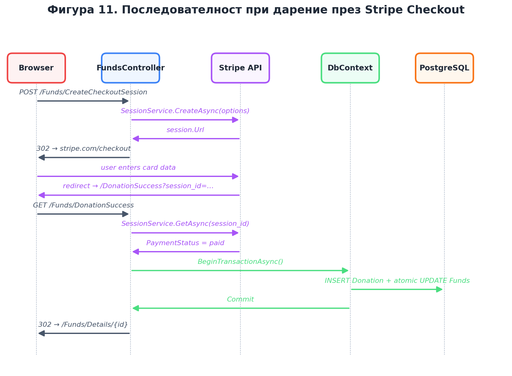{ width=16cm }

**Фигура 11 – Последователност при извършване на дарение през Stripe Checkout**

В допълнение към sequence диаграмата, жизненият цикъл на едно дарение като последователност от състояния е представен на Фигура 11.1. Дарението започва в Cart състояние (когато потребителят е избрал сума), преминава през Stripe Session, Hosted Checkout и Verified, преди да достигне финалното състояние Recorded. Възможни са две алтернативни състояния – Cancelled (когато потребителят се откаже на Stripe страницата) и Failed (при грешка от Stripe API).

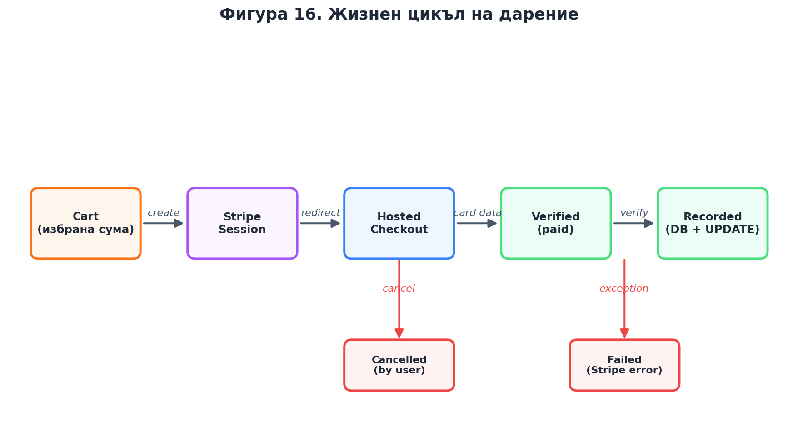{ width=15cm }

**Фигура 11.1 – Жизнен цикъл на дарение (състояния)**

### 2.3.5. Real-time компоненти

Real-time компонентите на KryskataFund правят платформата жива и динамична. Те създават у потребителя усещане, че се намира в активна среда, в която постоянно нещо се случва – нови дарения пристигат, нови кампании се появяват, кампании достигат своите цели. Това усещане е важно за крауфъндинг платформа, тъй като подсилва социалното доказателство и насърчава ангажираност.

Първата real-time функционалност е панелът със статистики на главната страница, който показва четири ключови индикатора: Total Raised (общо набрани средства от всички кампании в платформата), Live Campaigns (брой активни кампании), Today's Impact (общо средства, набрани днес), и Avg. Support (средна стойност на дарение). Тези статистики се обновяват автоматично на всеки няколко секунди чрез периодично запитване към сървъра.

Втората е activity feed – активен поток от събития, който показва последните 5 значими събития в платформата – нови дарения, нови кампании и достигнати междинни цели (milestones). Всяко събитие се показва с подходяща икона, кратък текст и времеви маркер от типа „2 min ago" или „3h ago", който се изчислява от сървъра чрез помощната функция `GetTimeAgo`.

#### Сървърна страна — endpoint-и за live данни

На сървърната страна `HomeController` предоставя два специализирани endpoint-а за real-time данни. `GetLiveStats` изчислява чрез LINQ агрегации текущите стойности на „Today's Impact" и „Avg. Support" и ги връща като JSON. `GetRecentActivity` обединява последните дарения, нови кампании и достигнати milestones в общ хронологично подреден списък. Кодът на двата метода е представен на Фигура 12:

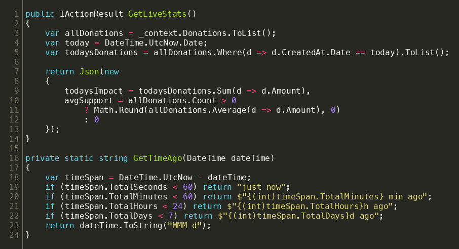

**Фигура 12 – Endpoint за live статистики и помощна функция за хуманизиране на времеви маркери**

#### Клиентска страна — polling с hash детекция

На клиентската страна real-time компонентите са реализирани изцяло чрез vanilla JavaScript и `fetch` API, без зависимост от външни рамки. Подходът е periodic polling с hash-базирана детекция – на всеки 5 секунди клиентът прави заявка към сървъра, изчислява хеш стойност на получения JSON и я сравнява с предишната запазена стойност. Ако стойностите съвпадат, обновяването на DOM се пропуска. Това подобрява плавността на страницата и пести изчислителен ресурс на клиента. Опростена илюстрация на алгоритъма е представена на Фигура 13:

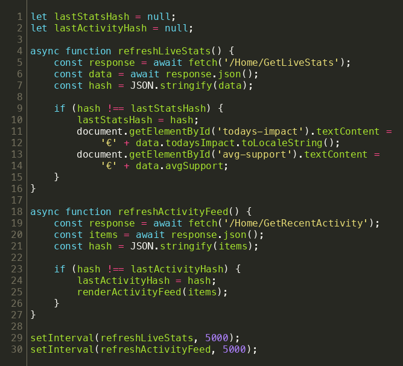

**Фигура 13 – Клиентски polling с hash-базирана детекция на промени**

#### Защо polling, а не SignalR

Изборът на periodic polling вместо SignalR или WebSockets беше съзнателно решение, основано на анализа на изискванията. SignalR изисква поддържане на постоянна WebSocket връзка за всеки клиент, което увеличава сложността на хостинговата инфраструктура и потенциално задръства connection pool-а на сървъра при голям брой потребители. Polling, от друга страна, използва обикновени HTTP заявки, които са stateless и лесни за кеширане, балансиране на натоварването и мониторинг. За мащаба на дипломния проект – десетки до стотици едновременни потребители – забавянето от 5 секунди при обновяване на статистиките е напълно приемливо. При евентуално бъдещо разширяване на платформата към хиляди едновременни потребители, real-time компонентите могат да бъдат мигрирани към SignalR или Server-Sent Events, без да се променя сървърната логика на агрегиране на данни.

Описаният механизъм е представен схематично на Фигура 14. На всеки 5 секунди клиентският JavaScript изпраща fetch заявка към специален endpoint в HomeController, който връща актуалните данни като JSON. Клиентът изчислява хеш стойност и я сравнява с предишно запазената; ако са различни, интерфейсът се обновява, в противен случай обновяването се пропуска.

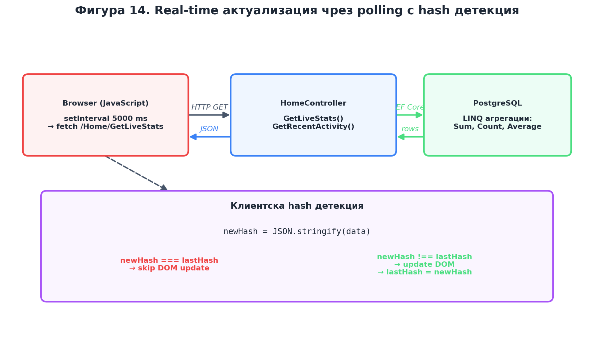{ width=15cm }

**Фигура 14 – Real-time актуализация чрез polling с hash детекция**

### 2.3.6. Конфигурация на HTTP pipeline

Стартирането на ASP.NET Core приложение преминава през конфигуриране на HTTP request pipeline-а – подредена последователност от middleware компоненти, всеки от които обработва входящата заявка преди да я предаде на следващия в реда. Редът на регистриране е критично важен, тъй като определя кои middleware се изпълняват преди други и съответно как заявката се обогатява и валидира по пътя си към съответния action.

Файлът `Program.cs` на KryskataFund конфигурира pipeline-а с няколко ключови middleware-а в строго определен ред. Кодът на Фигура 15 показва централната част от тази конфигурация:

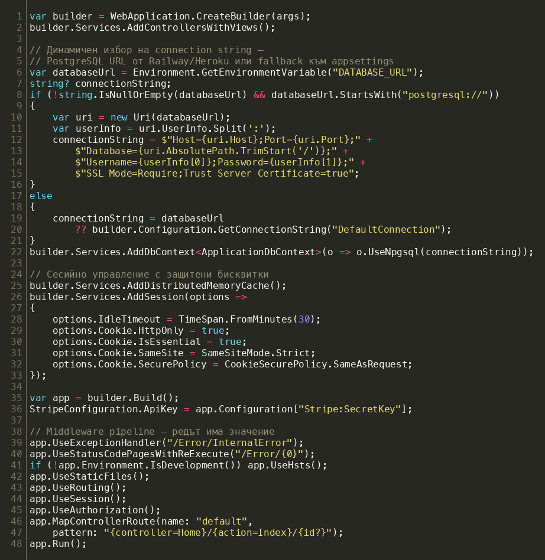

**Фигура 15 – Конфигурация на HTTP pipeline в Program.cs**

Регистрираните middleware-и могат да бъдат разделени по функция. **Сигурността** е представена от `UseHsts` (HTTP Strict Transport Security в продукция), `UseHttpsRedirection` (пренасочване към HTTPS в development) и защитените сесийни бисквитки (`HttpOnly`, `SameSite=Strict`). **Обработката на грешки** се осъществява от `UseExceptionHandler` за необработени изключения и `UseStatusCodePagesWithReExecute` за персонализирани страници при HTTP грешки 403, 404 и 500. **Маршрутизацията** е дефинирана чрез `MapControllerRoute` със стандартен шаблон. **Сесийното управление** идва преди оторизацията, така че сесийните данни да бъдат достъпни при проверките за достъп.

Графично представяне на целия конвейер от middleware-и в подходящия за изпълнение ред е дадено на Фигура 15.1. Всяка кутия представлява един регистриран middleware, а стрелките показват реда, в който заявката преминава през тях преди да достигне до съответния action метод.

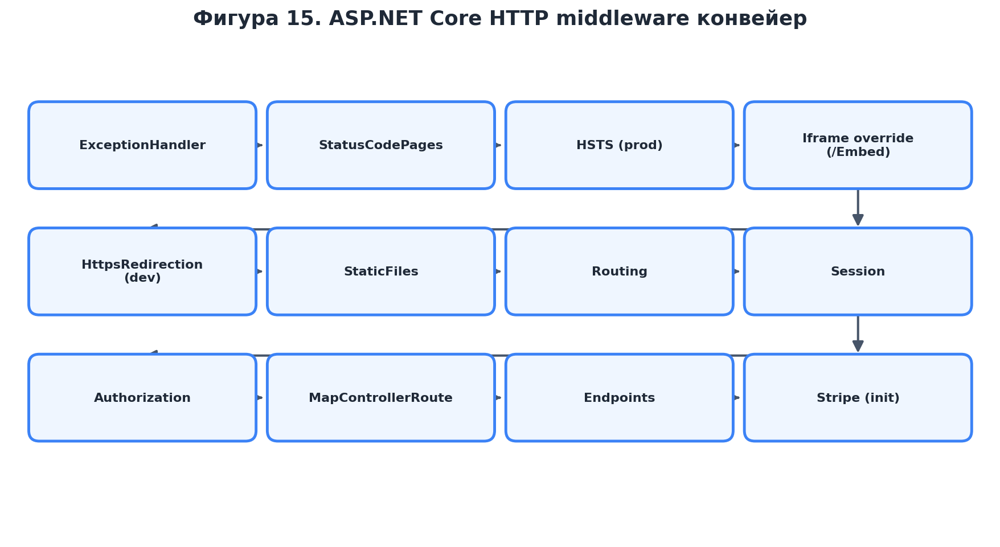{ width=15cm }

**Фигура 15.1 – HTTP middleware конвейер на KryskataFund**

Особено внимание заслужава динамичното построяване на connection string-а. KryskataFund е проектиран да работи в две различни среди – локална разработка и облачен хостинг. Когато присъства средова променлива `DATABASE_URL` (зададена автоматично от Railway, Heroku или Render), приложението я парсва като URI и я конвертира във формат, разбираем от Npgsql драйвера. Когато такава променлива липсва, приложението използва connection string-а от `appsettings.json` (или user-secrets в development). Този подход позволява един и същ кодов вариант да работи както локално, така и в облака, без необходимост от условни компилационни директиви или различни конфигурационни файлове.

Едно специално изключение в pipeline-а заслужава внимание – премахването на `X-Frame-Options` за пътя `/Funds/Embed`. Това позволява вграждането на embed widget-а в чужди сайтове чрез `<iframe>`, без браузърите да го блокират по подразбиране. Без това изключение функционалността за външно вграждане на кампании би била невъзможна.

---

## 2.4. Описание на използвани софтуерни технологии

### 2.4.1. ASP.NET Core 8

ASP.NET Core е модерна, високопроизводителна и кросплатформена рамка за изграждане на уеб приложения и API услуги, разработена и поддържана от Microsoft. Тя представлява пълно преизграждане на класическия ASP.NET Framework, при което се поставя акцент върху модулност, производителност, преносимост и съвременни архитектурни принципи. ASP.NET Core 8 е една от най-новите версии на рамката към момента на разработка на дипломния проект и предоставя широк набор от подобрения спрямо предходните версии – по-висока производителност, по-добра поддръжка за облачни среди, опростено конфигуриране и нови функционалности за работа с минимални API-та.

Една от основните характеристики на ASP.NET Core е неговата кросплатформеност. За разлика от стария ASP.NET, който работеше само на Windows и изискваше Internet Information Services (IIS), новата рамка може да се изпълнява еднакво добре на Windows, Linux и macOS. Това отваря възможността за хостване на приложения в най-различни среди – от собствен Linux сървър до контейнеризирана среда на Docker, от Microsoft Azure до Amazon Web Services и Google Cloud Platform. За проекта KryskataFund това е значително предимство, тъй като дава свобода в избора на хостинг среда без да налага конкретна операционна система.

ASP.NET Core е изграден около концепцията за middleware – слоести компоненти, които обработват HTTP заявките една след друга. Всеки middleware може да модифицира заявката, да върне отговор или да предаде заявката към следващия middleware в конвейера. Този подход прави рамката изключително гъвкава – разработчикът може да включи или изключи отделни функционалности като удостоверяване, логване, кеширане и работа със статични файлове, в зависимост от нуждите на приложението.

Конфигурирането на ASP.NET Core приложение се извършва главно в централния файл Program.cs. Там се регистрират необходимите услуги в Dependency Injection контейнера, конфигурират се connection string-ове за бази данни, добавят се middleware-и в конвейера и се определя какви изгледи и контролери да бъдат използвани. Този централизиран подход прави конфигурацията ясна, прозрачна и лесна за поддръжка.

Друго важно предимство на ASP.NET Core е неговата производителност. Според независими тестове, рамката е една от най-бързите за изграждане на уеб приложения и API услуги в индустрията, конкурираща се с решения като Node.js, Go и Rust. Това е важно за платформа от тип крауфъндинг, която потенциално може да обработва голям брой едновременни заявки – особено при популярни кампании, които привличат голям трафик.

Сигурността също е силна страна на ASP.NET Core. Рамката включва вградени механизми за защита срещу най-разпространените уеб атаки – cross-site scripting (XSS), cross-site request forgery (CSRF), SQL injection и подобни. Освен това тя предлага удобни абстракции за управление на потребители, роли, удостоверяване и оторизация. В KryskataFund се използват именно тези вградени механизми, за да се гарантира безопасността на потребителските данни.

### 2.4.2. C#

C# (произнася се „си-шарп") е модерен обектно-ориентиран език за програмиране, разработен от Microsoft в края на 90-те и началото на 2000-те години под ръководството на Андерс Хейлсберг. Езикът е създаден като част от .NET платформата и оттогава се е развил в един от най-използваните езици в света, особено за разработка на корпоративни приложения, уеб услуги, мобилни приложения и игри.

C# съчетава най-добрите елементи от C++, Java и други езици, като в същото време въвежда множество модерни функционалности, които правят разработката по-приятна и по-малко податлива на грешки. Сред тези функционалности могат да се отбележат силната статична типизация, обектно-ориентираното програмиране с поддръжка на наследяване и интерфейси, generic типовете, делегатите и lambda изразите, async/await за асинхронно програмиране, pattern matching, nullable reference types и много други.

Силната статична типизация е особено важна характеристика, която прави C# подходящ за големи и сложни проекти. Компилаторът проверява типовете на всички променливи, методи и изрази по време на компилация, което позволява откриване на голяма част от грешките преди приложението изобщо да бъде стартирано. Това значително намалява броя на runtime грешките и прави кода по-надежден.

Обектно-ориентираният подход на C# позволява структуриране на кода в класове и обекти, които моделират реални концепции от приложението. В KryskataFund това се вижда ясно – всеки тип данни, който системата управлява, е представен от отделен клас (User, Fund, Donation, FundUpdate), а всяка група свързани функционалности е разположена в съответния контролер (HomeController, AccountController, FundsController).

C# поддържа и функционални елементи, като lambda изрази и LINQ заявки, които правят работата с колекции от данни изключително елегантна. Вместо да се пишат дълги цикли с множество ред код, разработчикът може да използва кратки и четливи изрази като списъци.Where(x => x.Active).OrderBy(x => x.Name) – синтаксис, който напомня SQL, но работи директно върху обекти в паметта.

Asynchronous програмирането с async/await е друга силна страна на C#. Когато приложението трябва да изчака резултат от бавна операция (например заявка към база данни или мрежова заявка), asynchronous методите позволяват да не се блокира основната нишка, а да се освободи за обработка на други заявки. Това е особено важно за уеб приложения, които трябва да обслужват голям брой потребители едновременно.

Освен техническите си качества, C# има и голяма и активна общност от разработчици, отлична документация на Microsoft и широк набор от налични библиотеки и инструменти. Това прави езика отличен избор за дипломен проект, тъй като всякакви проблеми, които възникнат по време на разработката, могат лесно да бъдат решени чрез търсене в публични източници.

### 2.4.3. MVC архитектурен модел

Model-View-Controller (MVC) е архитектурен шаблон, който разделя приложението на три ясно дефинирани компонента, всеки със своя специфична отговорност. Този шаблон е възникнал в края на 70-те години на XX век в средата на езика Smalltalk и оттогава се е превърнал в стандарт в съвременната уеб разработка. Той се използва във всички значими backend рамки – ASP.NET Core MVC, Spring MVC за Java, Ruby on Rails, Django за Python, Laravel за PHP и много други.

Моделът (Model) представлява данните и бизнес логиката на приложението. В контекста на KryskataFund това включва обектите User, Fund, Donation и FundUpdate, както и логиката, която описва как тези обекти взаимодействат помежду си – например как се изчислява прогресът на кампания към нейната цел, как се обработва ново дарение, как се валидират входните данни. Моделът не знае нищо за това как тези данни се представят пред потребителя – той само описва тяхната структура и поведение.

Изгледът (View) отговаря за представянето на данните пред потребителя. В ASP.NET Core MVC изгледите се пишат с използване на синтаксиса Razor, който позволява смесване на HTML и C# код в един файл. Изгледите получават данните от контролерите чрез модели или ViewBag и ги представят във формат, подходящ за визуализация в браузъра. Изгледите не съдържат бизнес логика – те само описват как изглежда крайният резултат.

Контролерът (Controller) е посредникът между Model и View. Той получава HTTP заявките от потребителя, обработва ги, взаимодейства с моделите (например прави заявки към базата данни) и накрая връща съответния изглед, който трябва да бъде показан на потребителя. В KryskataFund има няколко контролера, всеки отговорен за конкретна област от функционалностите – HomeController за главната страница, AccountController за потребителската система и FundsController за кампаниите и дарения.

Едно от главните предимства на MVC шаблона е разделението на отговорностите. Всеки компонент има ясна, ограничена роля, което прави кода по-четлив, по-лесен за поддръжка и по-устойчив на промени. Когато трябва да се промени дизайнът на интерфейса, се променят само изгледите. Когато трябва да се промени бизнес логиката, се променят само моделите. Когато трябва да се добави нова функционалност, обикновено се добавя нов метод в подходящия контролер.

Друго важно предимство е тестваемостта на кода. Тъй като моделите и контролерите са независими от изгледите, те могат да бъдат тествани отделно чрез unit тестове, без да се налага да се стартира пълен браузър. Това позволява автоматизирано тестване на бизнес логиката и значително подобрява качеството на крайния продукт.

MVC шаблонът също така улеснява работата в екип. Различни членове на екипа могат да работят паралелно върху различни компоненти – единият върху изгледите и потребителския интерфейс, а другият върху моделите и бизнес логиката – без да си пречат един на друг.

### 2.4.4. Razor Views

Razor е специален синтаксис за писане на динамични HTML страници в ASP.NET, разработен от Microsoft. Той представлява начин за смесване на HTML код и C# код в един файл, така че сървърът да може динамично да генерира страници в зависимост от данните. Razor е сравним с други шаблонни енджини като Twig (PHP), Jinja2 (Python) и ERB (Ruby), но се отличава с особено лаконичен и интуитивен синтаксис.

Един Razor файл обикновено има разширение .cshtml и съдържа смес от HTML елементи и C# изрази. C# изразите започват със символа @ и могат да бъдат както прости стойности (например @Model.Title), така и пълни блокове код (например @{ var greeting = "Здравей"; } или @foreach (var item in items) { ... }). Razor енджинът прочита файла, обработва C# изразите и накрая генерира чист HTML, който се изпраща към браузъра.

В KryskataFund Razor се използва за всички изгледи на приложението. Главната страница (Index.cshtml) използва Razor, за да изобрази динамично списъка с активни кампании, статистиките в реално време и активния поток от събития. Страницата за създаване на кампания (Create.cshtml) използва Razor за изобразяване на формата и live preview-то. Детайлната страница на кампания (Details.cshtml) показва пълна информация за кампанията, прогрес лентата и списъка с дарители, като всичко това се генерира динамично спрямо данните, получени от контролера.

Една от мощните функционалности на Razor е концепцията за Layouts – общи шаблони, които съдържат повтарящи се елементи на интерфейса (например навигационна лента, footer, общи скриптове). Всеки изглед може да наследи от съответния layout и да попълва само своето специфично съдържание. В KryskataFund това е реализирано чрез _Layout.cshtml, който съдържа навигационната лента и общата структура на страницата, а всички останали изгледи наследяват от него.

Razor поддържа също така Partial Views – по-малки изгледи, които могат да бъдат вмъквани в други изгледи. Това позволява извличане на повтарящи се компоненти (например карта на кампания) в отделни файлове, които могат да бъдат използвани навсякъде в приложението. По този начин се избягва дублиране на код и се улеснява поддръжката.

Тагове helpers (Tag Helpers) са друга функционалност на Razor, която позволява разширяване на стандартните HTML тагове с допълнителна логика. Например, специален таг helper може да генерира линк към друг контролер и action, без да се налага ръчно сглобяване на URL адреса. Това прави Razor изгледите още по-лесни за писане и поддръжка.

### 2.4.5. Entity Framework Core

Entity Framework Core (EF Core) е модерна, лека и кросплатформена обектно-релационна рамка за достъп до бази данни в .NET екосистемата. Тя позволява на разработчиците да работят с данни като с обекти на C#, без да се налага да пишат ръчно SQL заявки. EF Core е пълно преизграждане на класическия Entity Framework, оптимизирано за модерни сценарии и по-висока производителност.

Основната концепция в EF Core е DbContext – клас, който описва структурата на базата данни и предоставя достъп до отделните таблици. В KryskataFund тази роля изпълнява ApplicationDbContext, който дефинира DbSet-ове за User, Fund, Donation и FundUpdate. Всеки DbSet представлява таблица в базата данни и позволява извършване на операции върху нея – четене, запис, актуализация и изтриване. Самата дефиниция на класа е представена на Фигура 16:

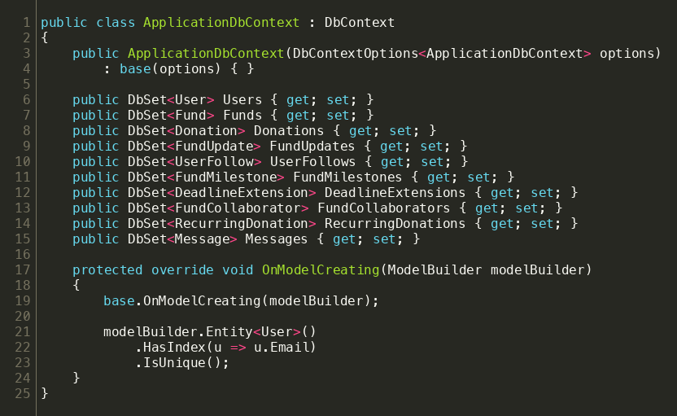

**Фигура 16 – Дефиниция на ApplicationDbContext**

EF Core поддържа подхода „Code First", при който разработчикът дефинира моделите си като C# класове, а рамката автоматично генерира съответните таблици в базата данни. Това е много удобен подход, тъй като позволява поддържането на единен източник на истина – C# кодът – вместо да се налага паралелно поддържане на SQL скриптове и обектни модели. Промените в моделите се отразяват в базата данни чрез миграции (migrations) – файлове, които описват точно какви промени трябва да бъдат направени.

Заявките към базата данни в EF Core се пишат с използване на LINQ (Language Integrated Query). Това е елегантен синтаксис, който позволява изразяване на сложни заявки на чист C#, без да се налага писане на SQL. EF Core преобразува LINQ заявките в съответните SQL изрази и ги изпълнява на базата данни. Например, заявка като context.Funds.Where(f => f.Category == "Education").OrderByDescending(f => f.RaisedAmount).Take(10) автоматично се превръща в съответната SQL заявка със съответните WHERE, ORDER BY и LIMIT клаузи.

EF Core поддържа множество системи за бази данни – SQL Server, SQLite, PostgreSQL, MySQL, Oracle и други. За KryskataFund е избран PostgreSQL през доставчика Npgsql, тъй като той предоставя зряла, надеждна и production-готова основа, която работи еднакво добре в среда за разработка и в облачна среда.

Освен основните функционалности, EF Core предлага и редица напреднали възможности – проследяване на промени (change tracking), ленивo и активно зареждане на свързани обекти (lazy и eager loading), кеширане на заявки, обединения (transactions), оптимизация на заявки и много други. Всички тези функционалности правят EF Core отличен избор за приложения от различни мащаби – от малки дипломни проекти до големи корпоративни системи.

### 2.4.6. LINQ

Language Integrated Query (LINQ) е една от най-силните страни на C# и .NET платформата. Това е синтактично разширение на езика, което позволява изразяване на заявки върху колекции от данни директно в кода, без да се налага използване на отделен език като SQL. LINQ е универсален – може да се прилага върху обекти в паметта, бази данни, XML документи, JSON данни и почти всякакви други източници на данни.

Основната идея на LINQ е, че всяка колекция (например списък, масив или резултат от заявка към база данни) може да бъде филтрирана, сортирана, групирана и трансформирана с използване на стандартен набор от методи – Where, Select, OrderBy, GroupBy, Join, Aggregate, First, FirstOrDefault, Single, Any, All и много други. Тези методи могат да се верижно свързват, образувайки сложни заявки, които въпреки сложността си остават изключително четливи.

В KryskataFund LINQ се използва навсякъде, където се работи с данни. На главната страница списъкът с активни кампании се извлича чрез LINQ заявка, която филтрира кампаниите по тяхната крайна дата (само тези, които още не са изтекли) и ги сортира по дата на създаване. Статистиките за деня се изчисляват чрез агрегационни функции – Sum за общата сума, Count за броя на даренията, Average за средната стойност. Активният поток от събития също използва LINQ, за да обедини последните дарения, нови кампании и нови актуализации в един общ списък, сортиран по време.

LINQ има две основни форми – method syntax (синтаксис на методи) и query syntax (заявков синтаксис). Method syntax използва стандартните методи на колекциите, например `funds.Where(f => f.Active).OrderBy(f => f.Title)`. Query syntax напомня SQL и изглежда например така: `from f in funds where f.Active orderby f.Title select f`. Двата синтаксиса са еквивалентни и се компилират до един и същ резултат. В KryskataFund се използва предимно method syntax, тъй като той е по-кратък и удобен за по-прости заявки.

Една от важните концепции в LINQ е отложеното изпълнение (deferred execution). Когато се напише LINQ заявка, тя не се изпълнява веднага – резултатите се изчисляват чак когато реално се поиска консумиране на данните (например чрез цикъл foreach или метод като ToList). Това позволява оптимизации – ако заявката се добави като част от по-голяма заявка, цялата комбинирана заявка може да бъде преобразувана в един SQL израз и изпълнена ефективно от базата данни.

### 2.4.7. PostgreSQL

PostgreSQL, наричана още Postgres, е една от най-зрелите, надеждни и широко използвани релационни системи за управление на бази данни (RDBMS) с отворен код. Тя се развива активно от Глобалната група за развитие на PostgreSQL (PostgreSQL Global Development Group) от средата на 90-те години и днес е призната за един от най-силните и пълнофункционални SQL сървъри на пазара. PostgreSQL се използва от компании от всякакъв мащаб – от малки стартъпи до големи корпорации като Apple, Reddit, Instagram, Spotify, Twitch и много други.

В KryskataFund PostgreSQL играе ролята на основно хранилище на всички данни в платформата – потребителски профили, кампании, дарения, актуализации, последователи, междинни цели, удължавания на срокове, периодични дарения и съобщения. Връзката с базата данни се конфигурира чрез променливата на средата `DATABASE_URL`, което улеснява хостването в облачни среди като Heroku, Render, Railway и подобни услуги, които автоматично инжектират URL адреса на базата.

PostgreSQL поддържа всички стандартни ACID свойства на транзакциите – атомарност, консистентност, изолация и трайност. Това е особено важно за крауфъндинг платформа, при която всяко дарение трябва да обновява няколко стойности едновременно (събрана сума, брой дарители, запис в таблицата на даренията) и тези операции трябва или да успяват напълно, или да се отменят напълно. PostgreSQL гарантира тази атомарност чрез вградения си мощен механизъм на транзакции.

Една от ключовите силни страни на PostgreSQL е поддръжката на сложни типове данни – освен стандартните INTEGER, TEXT, NUMERIC и BOOLEAN, тя предоставя JSON и JSONB за съхранение на полу-структурирани данни, масиви, hstore за пар ключ-стойност, UUID, географски типове през разширението PostGIS и много други. За проекта KryskataFund в момента се използват предимно стандартните типове, но богатата система от типове е валидна основа за бъдещо разширяване.

PostgreSQL предлага зряла поддръжка за индексиране – B-tree, hash, GIN, GiST, BRIN и партициални индекси, които позволяват оптимизация на конкретни типове заявки. В контекста на KryskataFund върху таблицата User е създаден уникален индекс по поле Email, което гарантира, че два потребителя не могат да имат един и същ имейл адрес и същевременно прави търсенето по имейл максимално бързо.

Сигурността е силна страна на PostgreSQL. Базата данни поддържа ролеви контрол на достъпа (RBAC), редовно ниво на сигурност (row-level security), SSL/TLS криптиране на връзките, множество механизми за удостоверяване (парола, peer, GSSAPI, LDAP, certificate) и подробни логове за одит. За production хостване на платформата се използва SSL Mode=Require, така че комуникацията между приложението и базата винаги да бъде криптирана.

Връзката с PostgreSQL от страна на ASP.NET Core се осъществява чрез официалния доставчик Npgsql, който се интегрира директно с Entity Framework Core. По време на разработката базата данни може да се стартира локално чрез Docker, Postgres.app или нативна инсталация, а в production се използва managed услуга от облачния доставчик. Тази архитектура осигурява гладък преход между средите за разработка, тестване и production, без необходимост от каквито и да е промени в кода.

### 2.4.8. HTML5

HyperText Markup Language (HTML) е езикът, на който е изграден почти всеки документ в световната мрежа. Това е маркиращ език, който описва структурата и съдържанието на уеб страниците чрез система от тагове и атрибути. HTML съществува в различни версии от своето създаване в началото на 90-те години, а HTML5 е най-новият голям стандарт, който въвежда множество съвременни функционалности и подобрения.

HTML5 въвежда нови семантични тагове като header, nav, main, article, section, aside и footer, които позволяват по-точно описване на структурата на страницата. Тези тагове не променят визуалния изглед на страницата, но дават важна семантична информация на браузърите, търсачките и инструментите за достъпност. Например, screen reader-и за хора с нарушения на зрението могат да използват тази информация, за да предоставят по-смислена навигация на потребителите.

HTML5 също въвежда нови типове input полета – email, url, tel, date, time, color, range, search и други. Тези типове позволяват на браузърите да извършват автоматична валидация на входните данни и да предоставят специализирани контроли за въвеждане. Например, input type="date" в съвременните браузъри показва календар, от който потребителят може да избере дата, вместо да въвежда текстово.

В KryskataFund HTML5 се използва за изграждане на цялата структура на интерфейса. Семантичните тагове се използват, за да опишат различните части на страниците – навигационната лента, главното съдържание, footer-а. Формите за регистрация, вход, създаване на кампания и дарение използват съвременни типове input, които осигуряват по-добра валидация и по-удобно потребителско изживяване. Допълнително се използват HTML5 елементи като progress за визуализация на прогреса на кампания и canvas за някои визуални ефекти.

### 2.4.9. CSS3

Cascading Style Sheets (CSS) е технологията, която отговаря за визуалния изглед на уеб страниците. CSS позволява разделяне на съдържанието (HTML) от презентацията (стиловете), което улеснява поддръжката на уебсайтове и подобрява тяхната достъпност. CSS3 е най-новият голям стандарт, който въвежда множество мощни функционалности – flexbox, grid, transitions, animations, media queries, custom properties (CSS променливи), gradients, shadows, transforms и много други.

В KryskataFund CSS3 се използва не просто за описание на цветове и размери, а за изграждане на цялостен модерен дизайн с тъмна тема, плавни анимации и интерактивни елементи. Custom properties (CSS променливи) се използват за централизирано управление на цветовете и размерите, така че при необходимост от промяна на дизайна да се актуализират само няколко стойности на едно място. Flexbox и Grid се използват за изграждане на гъвкави и адаптивни оформления, които се адаптират автоматично към различни размери на екрана.

CSS transitions и animations придават живот на интерфейса. Бутоните плавно сменят цвета си при hover, картите на кампаниите се повдигат с лека сянка при насочване на курсора, прогрес лентата се запълва с анимация при зареждане на страницата. Тези малки детайли значително подобряват потребителското изживяване и правят използването на платформата приятно.

Media queries позволяват responsive дизайн – интерфейсът се адаптира към различни устройства и размери на екрана. На широки десктоп монитори се показва многоколонен layout с богато съдържание. На таблети броят на колоните се намалява, а на мобилни устройства се преминава към едноколонен layout, оптимизиран за докосване с пръст.

### 2.4.10. JavaScript

JavaScript е програмният език на уеб браузъра. Той се изпълнява от страна на клиента (в браузъра на потребителя) и позволява динамично взаимодействие с потребителския интерфейс. JavaScript е развит значително от своето създаване през 1995 година и днес е един от най-популярните езици в света, използван не само в уеб браузъри, но и в сървърни среди (Node.js), мобилни приложения (React Native), настолни приложения (Electron) и много други.

В KryskataFund JavaScript се използва за реализация на всички динамични функционалности на интерфейса. Live preview-то на формата за създаване на кампания се реализира изцяло с JavaScript – при всяка промяна в полетата, предварителният преглед отдясно се обновява автоматично. Филтрирането на кампании по категория също е реализирано с JavaScript – клиентската страна показва или скрива съответните карти, без да се налага презареждане на цялата страница.

Real-time компонентите – статистиките и activity feed-ът – също разчитат на JavaScript. На всеки няколко секунди клиентът прави asynchronous заявка към сървъра чрез fetch API, получава актуалните данни в JSON формат и обновява съответните части от интерфейса. За оптимизация се използва hash-базирана детекция – ако данните не са се променили от предишната заявка, обновяването се пропуска.

JavaScript поддържа модерни функционалности като arrow functions, destructuring, template literals, async/await, modules и много други. В KryskataFund се използва изключително модерен JavaScript синтаксис (ES6+), който е поддържан от всички съвременни браузъри. Не се използват тежки frontend рамки като React или Angular, тъй като приложението не изисква толкова сложна интерактивност, и vanilla JavaScript е напълно достатъчен за нуждите на проекта.

### 2.4.11. Сесийно управление и автентикация

Сесийното управление е механизъм, чрез който уеб приложението следи кои потребители са влезли в системата и предоставя им достъп до защитените страници. ASP.NET Core предоставя вграден механизъм за сесии, който е лесен за конфигуриране и използване. В KryskataFund сесиите се конфигурират в Program.cs чрез добавяне на услугите AddDistributedMemoryCache и AddSession.

При вход в системата, контролерът проверява валидността на въведените данни и при успех създава сесия за потребителя. В сесията се записва идентификаторът на потребителя, който след това може да бъде прочетен на всяка следваща заявка. Сесиите имат време на изтичане (idle timeout) – ако потребителят не извършва никакви действия в продължение на определен период, сесията автоматично изтича и той трябва да влезе отново.

За допълнителна сигурност, сесийните бисквитки в KryskataFund са конфигурирани като HttpOnly – това означава, че те не са достъпни от JavaScript код, изпълняван в браузъра. Тази настройка предотвратява атаки от тип cross-site scripting (XSS), при които злонамерен скрипт би могъл да открадне сесийната бисквитка и да я използва, за да се представи като потребителя.

Освен сесиите, ASP.NET Core предлага и по-напреднали механизми за автентикация – cookie-based authentication, token-based authentication (JWT), OpenID Connect и подобни. За мащаба на дипломния проект сесийното управление е напълно достатъчно и предоставя добър баланс между сигурност и простота на реализация.

### 2.4.12. Хеширане на пароли

Съхраняването на пароли е една от най-чувствителните теми в уеб разработката. Никога не трябва да се съхраняват пароли в чист (plain text) вид – ако базата данни бъде компрометирана, всички потребителски пароли биха станали достояние на нападателите. Освен това, тъй като много потребители използват едни и същи пароли за различни услуги, такъв пробив би могъл да доведе до компрометиране и на профилите им в други системи.

Решението е хеширане на паролите. Хеширането е еднопосочна криптографска операция, която преобразува паролата в фиксирана дължина символен низ (хеш). Същата парола винаги ще генерира същия хеш, но от хеша е практически невъзможно да се възстанови оригиналната парола. По време на регистрация се записва само хешът, а при опит за вход се хешира въведената парола и се сравнява с записания хеш.

В KryskataFund се използва модерен криптографски алгоритъм за хеширане на паролите, който включва salt – случайна последователност от символи, която се добавя към паролата преди хеширане. Salt-ът гарантира, че дори две еднакви пароли ще имат различни хешове, което прави атаките тип rainbow table неефективни. Освен това алгоритъмът е достатъчно бавен, за да направи brute force атаките непрактични – дори при милиарди опити в секунда, разбиването на парола би отнело години.

### 2.4.13. Stripe (платежна интеграция)

Stripe е една от най-популярните и широко използвани платежни платформи за уеб приложения, използвана от милиони компании по цял свят – от малки стартъпи до големи корпорации като Amazon, Lyft, Shopify и Spotify. Тя предоставя REST API и официални SDK-та за множество езици, включително .NET (`Stripe.net`), което прави интеграцията изключително лесна. Stripe се отличава с надеждна обработка на плащания в над 135 валути, мощни инструменти за разработчици, изключителна документация и гъвкава архитектура.

В KryskataFund Stripe играе ключова роля – обработка на всички дарения към кампании. Изборът на Stripe пред алтернативи като PayPal, Mollie или местни български платежни услуги беше мотивиран от няколко фактора. Първо, Stripe Checkout е хоствано платежно решение – потребителят е пренасочен към сигурна страница на Stripe, въвежда платежните си данни там и след успешно плащане е пренасочен обратно. Това означава, че платежните данни никога не преминават през сървъра на приложението, което освобождава KryskataFund от задължението да отговаря на изключително строгите PCI DSS изисквания за съхранение и обработка на данни от банкови карти. Второ, Stripe.net е напълно типобезопасна .NET библиотека, която се интегрира естествено с C# кода. Трето, Stripe предлага безплатен test mode, при който могат да се правят неограничен брой тестови плащания с тестови карти – нещо, което е безценно по време на разработка.

Интеграцията в KryskataFund включва три ключови компонента: създаване на Checkout Session при натискане на „Donate", пренасочване към Stripe-хостваната страница и верификация на сесията при връщане чрез `session_id`. Този трикомпонентен подход гарантира, че дарения се записват в базата данни само след реално и успешно плащане, потвърдено от самата Stripe.

### 2.4.14. Git и GitHub

Git е разпределена система за контрол на версиите, разработена от Линус Торвалдс през 2005 година. Тя позволява проследяване на промените в кода, връщане към предишни версии, разклоняване на разработката (branching) и сливане (merging) на различни линии на работа. Git е неизменна част от съвременната разработка на софтуер и е стандарт в индустрията.

В KryskataFund Git се използва за проследяване на всички промени в кода по време на разработката. Всяка значителна промяна се записва като commit с описателно съобщение, което обяснява какво е направено. Това позволява връщане към всяка предишна версия на кода в случай на проблем и предоставя пълна история на развитието на проекта.

GitHub е популярна онлайн платформа, която предоставя хостинг за Git репозитори, както и допълнителни функционалности като преглед на код, проследяване на проблеми (issues), автоматизация чрез GitHub Actions и социални функции. Кодът на KryskataFund се хоства в публично GitHub репозитори, което позволява на всеки да го разгледа, да направи свой клонинг (fork) и да допринесе с промени.

### 2.4.15. Visual Studio Code

Visual Studio Code (VS Code) е свободен и открит редактор на код, разработен от Microsoft. Той е изключително популярен сред разработчиците заради своята скорост, разширяемост и широка поддръжка на множество езици и инструменти. VS Code се отличава от тежките интегрирани среди за разработка (IDE) с това, че е лек и бърз, но в същото време предлага функционалности, сравними с тези на IDE-та чрез екосистема от разширения.

За разработката на KryskataFund VS Code се използва като основна среда. Той осигурява пълна поддръжка на C# чрез разширението C# Dev Kit, поддръжка на HTML, CSS и JavaScript, интегриран Git клиент, дебъгване, IntelliSense (автоматично попълване на код), линтери и много други функционалности. Работата с .NET CLI инструментите се извършва директно от вградения терминал на VS Code, което прави целия процес на разработка плавен и удобен.

### 2.4.16. Обобщение на технологичния стек

Долната таблица обобщава основните технологии, използвани в KryskataFund, заедно с тяхната роля в проекта и обосновката за избора. Тя дава бърза представа за технологичния стек и показва, че всеки избор е взет на базата на конкретни изисквания, а не по случаен принцип.

| Технология | Роля в проекта | Обосновка за избора |
|---|---|---|
| ASP.NET Core 8 | Backend рамка, MVC, HTTP pipeline | Висока производителност, кросплатформеност, зряла екосистема |
| C# 12 | Основен език за програмиране | Силна типизация, async/await, LINQ, активна общност |
| Razor Views | Шаблонен енджин за HTML | Естествена интеграция с ASP.NET Core, partial views, tag helpers |
| Entity Framework Core 8 | ORM за достъп до базата | Code-First, LINQ, миграции, поддръжка на множество доставчици |
| PostgreSQL + Npgsql | Релационна база данни | Зрялост, производителност, ACID транзакции, удобство при облачен хостинг |
| Stripe.net | Платежна интеграция | Хоствано Checkout, без PCI DSS отговорност, тип-безопасен .NET SDK |
| HTML5 / CSS3 / JS (ES6+) | Клиентска страна | Стандарти без зависимост от тежки рамки, плавни анимации |
| `System.Security.Cryptography` | Хеширане на пароли (SHA-256) | Вграден .NET механизъм без външни зависимости |
| Session middleware | Управление на потребителски сесии | Лесна настройка, HttpOnly + SameSite=Strict защити |
| `Microsoft.EntityFrameworkCore.InMemory` | База за тестова среда | Позволява unit тестове без реална база данни |
| Git + GitHub | Контрол на версиите и хостинг | Стандарт в индустрията, поддръжка на pull requests и actions |
| VS Code + C# Dev Kit | Среда за разработка | Лек, разширяем, кросплатформен |

**Таблица 2 – Обобщение на технологичния стек на KryskataFund**

Особено важна е способността на стека да работи в две конфигурации – локална (с user-secrets за PostgreSQL connection string) и облачна (с автоматично разпознаване на `DATABASE_URL` от Railway или Heroku). Тази гъвкавост е резултат не от една технология, а от комбинацията на ASP.NET Core конфигурационната система, Npgsql драйвера и Entity Framework Core с поддръжка на InMemory доставчик за тестове.

Графично представяне на технологичния стек, организирано около централния хъб на приложението, е дадено на Фигура 19. Всяка технология е свързана с ядрото и оцветена в съответствие със своята роля – синьо за основни рамки, зелено за достъп до данни, лилаво за външни услуги, червено за сигурност и оранжево за клиентската страна.

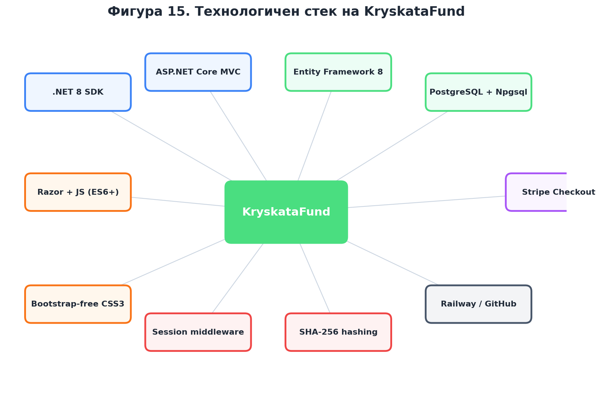{ width=15cm }

**Фигура 19 – Технологичен стек на KryskataFund (хъб-и-спици)**

## 2.5. Описание на използвани хардуерни и инфраструктурни технологии

KryskataFund е чисто софтуерен проект и не изисква специализирани хардуерни компоненти. Въпреки това, реалното внедряване на платформата в производствена среда изисква подходяща инфраструктура, която да осигури надеждна работа за крайните потребители. В този раздел се описват хардуерните и инфраструктурните аспекти, свързани с разработката, тестването и потенциалното внедряване на приложението.

За разработката се използва обикновен персонален компютър с достатъчно процесорна мощ, оперативна памет и дисково пространство. Минималните изисквания включват двуядрен процесор с честота поне 2 GHz, 8 GB оперативна памет и 50 GB свободно дисково пространство. Тези изисквания се отнасят както до писане на кода, така и до стартиране на приложението в режим на разработка с активиран hot reload, който автоматично рестартира приложението при промени в кода.

За хостване на приложението в производствена среда са възможни няколко основни подхода. Първият е използване на собствен Linux или Windows сървър, на който се инсталира .NET 8 SDK и приложението се стартира директно. Този подход е икономичен, но изисква опит в администрирането на сървъри. Вторият подход е хостване в облачна среда – Microsoft Azure App Service, Amazon Web Services Elastic Beanstalk, Google Cloud Run или подобни услуги. Тези услуги опростяват внедряването значително – достатъчно е да се качи приложението и да се конфигурират няколко основни настройки. Третият подход е контейнеризация чрез Docker, при което приложението се пакетира в контейнер, който може да се стартира на всяка платформа, поддържаща Docker.

За базата данни в производствена среда се използва PostgreSQL, която предлага отлична конкурентност, надеждна репликация, point-in-time recovery и широк набор от функционалности за резервно копиране. PostgreSQL се справя добре както с няколко хиляди едновременни потребители на стандартен managed instance, така и с мащабиране до милиони чрез read replicas и connection pooling (pgbouncer).

Мрежовите изисквания включват наличие на стабилна интернет връзка със скорост, която е достатъчна за обработване на очаквания трафик. За малка платформа е достатъчна връзка от 100 Mbps, докато за по-голяма – необходимо е поне 1 Gbps. Освен това приложението трябва да бъде защитено със SSL/TLS сертификат, който криптира комуникацията между клиента и сървъра.

За мониторинг и логване в производствена среда могат да се използват инструменти като Application Insights (за Azure), CloudWatch (за AWS), ELK Stack (Elasticsearch, Logstash, Kibana) или Grafana с Prometheus. Тези инструменти позволяват проследяване на производителността на приложението в реално време и бързо откриване на проблеми.

Цялостната архитектура на разгръщането в облака – от разработческата машина, през GitHub и Railway build pipeline-а, до продукционните контейнери и базата данни – е представена графично на Фигура 20. Всеки git push към главния клон автоматично задейства Railway pipeline-а, който изгражда нов Docker образ и стартира контейнер с обновеното приложение, без необходимост от ръчна намеса.

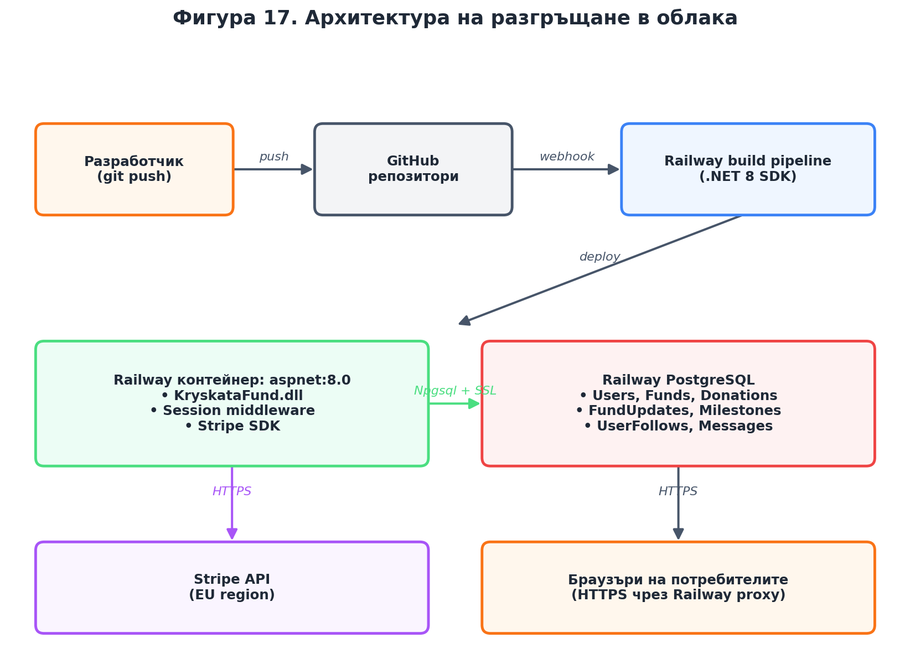{ width=15cm }

**Фигура 20 – Архитектура на разгръщане в облачна среда (Railway)**

---

## 2.6. Ръководство на потребителя

Преди да се пристъпи към подробното описание на отделните функционалности, е полезно да се представи цялостният потребителски поток от началото на сесията на потребителя до завършването на дарение. Този поток е илюстриран на Фигура 21 и включва шест последователни стъпки – от посещаването на главната страница, през филтриране и преглед на детайлите на конкретна кампания, до завършването на плащането през Stripe Checkout и обновяването на прогреса на кампанията.

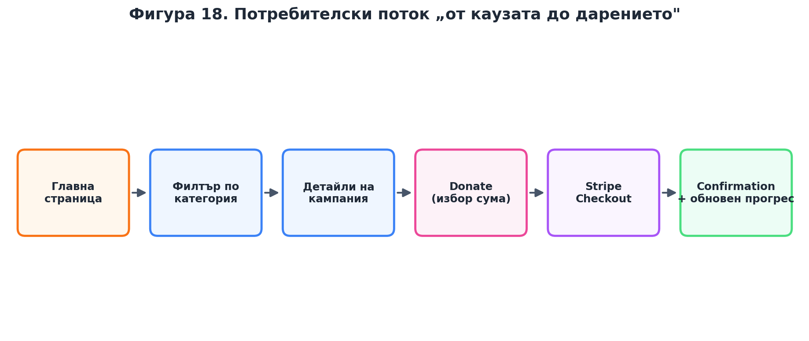{ width=15cm }

**Фигура 21 – Потребителски поток „от каузата до дарението"**

### 2.6.1. Системни изисквания

За да се използва пълноценно платформата KryskataFund, потребителят се нуждае от съвременен уеб браузър, който поддържа стандартите HTML5, CSS3 и съвременните възможности на JavaScript. Поддържаните браузъри включват Google Chrome версия 90 или по-нова, Mozilla Firefox версия 88 или по-нова, Apple Safari версия 14 или по-нова и Microsoft Edge версия 90 или по-нова. На по-стари браузъри някои визуални елементи и анимации може да не работят напълно коректно.

Освен браузър, потребителят се нуждае от стабилна интернет връзка. Минималната препоръчителна скорост е 1 Mbps, но за оптимално изживяване с бързо зареждане на изображения и плавна работа на real-time компонентите се препоръчва поне 5 Mbps. Платформата работи както на десктоп компютри, така и на лаптопи, таблети и мобилни телефони, тъй като дизайнът е responsive и се адаптира към различни размери на екрана.

За локално стартиране на приложението от страна на разработчик са необходими допълнителни инструменти. Първо, нужен е .NET 8 SDK, който може да бъде изтеглен безплатно от официалния сайт на Microsoft. Второ, нужен е git клиент за изтегляне на кода от GitHub. Трето, препоръчително е инсталиране на редактор на код като Visual Studio Code или Visual Studio. Дисковото пространство, необходимо за инсталацията, е около 100 MB.

### 2.6.2. Инсталация и стартиране

Стъпките за стартиране на приложението локално са следните. Първо, потребителят клонира репозиторито от GitHub чрез командата git clone, последвана от URL адреса на репозиторито. След това навигира до директорията на проекта чрез командата cd. Накрая стартира приложението чрез командата dotnet run, която компилира кода и стартира локален сървър на адрес https://localhost:5001 или http://localhost:5000.

При първото стартиране Entity Framework Core автоматично създава файла на базата данни (kryskatafund.db) в директорията на проекта, като прилага всички миграции. Това гарантира, че таблиците User, Fund, Donation и FundUpdate са създадени с правилната структура. След това приложението е готово за използване.

Потребителят отваря браузъра си и навигира до посочения адрес. На главната страница го посрещат списък с активни кампании (ако има такива), статистики в реално време и навигационна лента в горната част на екрана.

### 2.6.3. Регистрация и вход

За да могат да създават кампании или да даряват, потребителите трябва да имат активен профил в платформата. Регистрацията се извършва чрез натискане на бутона „Sign Up" в горния десен ъгъл на страницата. Това отваря форма за регистрация, в която потребителят въвежда валиден имейл адрес, парола и потвърждение на паролата. Имейл адресът трябва да бъде технически валиден и още нерегистриран в системата. Паролата трябва да бъде поне с шест символа, за допълнителна сигурност се препоръчва използването на комбинация от букви, цифри и специални символи.

[Снимка 1: Главна страница с навигационна лента и бутон „Sign Up" в горния десен ъгъл]

[Снимка 2: Формуляр за регистрация с полета имейл, парола и потвърждение]

След успешна регистрация потребителят бива автоматично влязал в системата и пренасочен към главната страница. Ако в бъдеще се появи нужда от повторно влизане, това става чрез бутона „Sign In", който отваря форма за вход. Потребителят въвежда своя имейл и парола, и при успешна автентикация получава достъп до защитените функционалности на платформата.

[Снимка 3: Формуляр за вход с полета имейл и парола]

При неуспешен опит за вход (грешен имейл или грешна парола), системата показва съответно съобщение за грешка, без да разкрива дали проблемът е в имейла или в паролата. Това е стандартна практика за сигурност, която затруднява опитите за компрометиране на профили чрез познаване на регистрирани имейли.

Излизането от системата се извършва чрез бутона „Sign Out" в горния десен ъгъл, който е видим само когато потребителят е влязъл. След излизане сесията се прекъсва и потребителят се връща към анонимното състояние.

### 2.6.4. Главна страница и навигация

Главната страница на KryskataFund е централната точка на платформата и предоставя достъп до всички основни функционалности. В горната част е разположена навигационната лента, която съдържа логото на платформата (което води обратно към главната страница), бутон за създаване на нова кампания (видим само за влезли потребители), бутон за достъп до профила и бутони за вход или регистрация.

[Снимка 4: Главна страница с панел Live Stats, филтър по категории и списък с активни кампании]

Под навигационната лента се намира секция със статистики в реално време. Тя показва общо набрани средства във всички активни кампании, брой активни кампании в момента, средствата, набрани днес от всички кампании и средната стойност на дарение в платформата. Тези стойности се обновяват автоматично на всеки няколко секунди, така че потребителят винаги вижда актуални данни.

[Снимка 5: Панел Live Stats с четирите ключови индикатора Total Raised, Live Campaigns, Today's Impact и Avg. Support]

След секцията със статистики е разположен филтър по категории. Той показва всички категории кампании – Education, Health, Animals, Creative, Dreams, Just for fun, Technology и Community – заедно с броя кампании във всяка категория. Чрез натискане на категория, потребителят филтрира списъка с кампании, така че да вижда само тези от избраната категория. Повторно натискане на същата категория или избор на „All" премахва филтъра.

Основната част на главната страница е заета от списъка с активни кампании. Всяка кампания се представя чрез карта, която показва нейното изображение, заглавие, категория, кратко описание, прогрес към целта и оставащо време. Картите имат интерактивни ефекти – при насочване на курсора те леко се повдигат, което създава приятно усещане за интерактивност. Натискането на карта води към детайлната страница на съответната кампания.

[Снимка 6: Карта на кампания с изображение, прогрес лента, оставащи дни и категориен бадж]

В долната част на страницата (или в страничен панел в зависимост от размера на екрана) е разположен activity feed – активен поток от събития. Той показва последните събития в платформата – нови дарения, нови кампании, нови актуализации – всяко с подходяща икона и времеви маркер. Този поток се обновява автоматично, така че потребителят може да наблюдава активността в платформата в реално време.

[Снимка 7: Activity Feed с последните 5 събития – нови дарения и нови кампании]

### 2.6.5. Създаване на кампания

Създаването на нова кампания е една от основните функционалности на платформата. То е достъпно само за влезли потребители чрез бутона „Make a fund" в навигационната лента. Натискането на бутона води до страницата за създаване на кампания, която е разделена на две части – форма отляво и live preview отдясно.

[Снимка 8: Страница за създаване на кампания с форма отляво и live preview отдясно]

Формата включва следните полета. „Title" (заглавие) е краткото име на кампанията – обикновено до 100 символа. То трябва да описва ясно за какво е кампанията. „Description" (описание) е по-дълъг текст, който подробно обяснява целта на кампанията, защо е важна и как ще бъдат използвани събраните средства. Описанието може да съдържа множество абзаци и до няколко хиляди символа. „Category" (категория) се избира от падащ списък с предварително дефинирани опции. „Goal" (цел) е сумата в лева, която създателят се надява да събере. „Duration" (продължителност) определя за колко дни ще бъде активна кампанията – обикновено между 7 и 60 дни. „Cover Image" (заглавно изображение) е незадължително поле, в което потребителят може да въведе URL адрес на изображение или да качи файл от своето устройство.

Едновременно с попълването на формата, отдясно се обновява live preview-то. То показва как ще изглежда картата на кампанията на главната страница след нейното създаване. Това позволява на потребителя веднага да види резултата и да направи корекции, преди финалното създаване. Live preview-то е реализирано изцяло с JavaScript и не изисква нови заявки към сървъра.

[Снимка 9: Live preview на кампания, обновяващ се в реално време при попълване на формата]

След като потребителят е удовлетворен от съдържанието, натиска бутона „Create Campaign". Системата извършва финална валидация на всички полета и при успех създава новата кампания в базата данни. Потребителят бива пренасочен към детайлната страница на новосъздадената кампания, където може да започне да я споделя с други хора.

### 2.6.6. Дарение към кампания

Процесът на дарение е централен за всяка крауфъндинг платформа и в KryskataFund е реализиран по интуитивен, приятен и сигурен начин чрез интеграция със Stripe. От детайлната страница на коя да е кампания, потребителят може да натисне бутона „Donate", който води към страница за дарение.

[Снимка 10: Детайлна страница на кампания с прогрес лента, описание и бутон „Donate"]

На страницата за дарение се показват предварително дефинирани суми – обикновено 5, 10, 25, 50, 100 EUR – чрез големи и видими бутони. Потребителят може да избере една от тези суми с едно натискане. Алтернативно, той може да въведе персонализирана сума в специално текстово поле. Сумата трябва да бъде положителна стойност и се валидира както от страна на клиента, така и от страна на сървъра.

[Снимка 11: Страница за дарение с предварително дефинирани суми и поле за персонализирана сума]

След потвърждение на сумата, потребителят бива пренасочен към сигурната, хоствана страница на Stripe Checkout. Там той въвежда платежните си данни – номер на карта, дата на изтичане, CVV и име на притежател. Платежните данни не преминават през сървъра на KryskataFund, което изключва приложението от обхвата на PCI DSS изискванията и значително повишава сигурността.

[Снимка 12: Stripe Checkout страница с поле за платежни данни]

След успешно плащане Stripe пренасочва потребителя обратно към KryskataFund. Системата верифицира сесията със Stripe, записва дарението в базата данни в рамките на транзакция и обновява статистиките на кампанията. Потребителят се връща в детайлната страница на кампанията, където незабавно вижда, че неговото дарение е отразено в прогрес лентата и в списъка с дарители. При достигане на междинна цел тя получава визуален индикатор „Reached".

[Снимка 13: Обновена детайлна страница след успешно дарение с „Donation successful" уведомление]

### 2.6.7. Управление на собствени кампании

Като създател на дадена кампания, потребителят разполага с допълнителни функционалности на нейната детайлна страница. Най-важната от тях е възможността за публикуване на актуализации (updates). Актуализациите са кратки съобщения, чрез които създателят информира своите подкрепящи за развитието на проекта – например за достигане на междинна цел, за нови резултати, за благодарности към дарителите.

[Снимка 14: Раздел Updates в детайлна страница на кампания с бутон „Post Update"]

Публикуването на актуализация се извършва чрез бутона „Post Update", който води към форма с две полета – заглавие и съдържание. След публикуване, новата актуализация се показва в специален раздел на детайлната страница на кампанията, така че всички бъдещи посетители да могат да я видят. Старите актуализации също се запазват, така че да се вижда хронологията на развитието на кампанията.

Освен актуализации, създателят може да дефинира междинни цели (milestones) за своята кампания. Всяка междинна цел има заглавие, описание и целева сума. Когато общата събрана сума достигне или надвиши целевата стойност на дадена междинна цел, тя автоматично се отбелязва като „Reached" с дата на достигане. Това предоставя на дарителите визуална обратна връзка за напредъка на кампанията отвъд простото проследяване на главната цел.

[Снимка 15: Секция Milestones с достигнати и недостигнати цели на кампания]

Създателят може да удължи крайния срок на кампанията си чрез функционалността DeadlineExtension и да добави съавтори (FundCollaborators), които също могат да управляват кампанията.

### 2.6.8. Профилна страница и персонализация

Профилната страница е достъпна чрез натискане на иконата на потребителя в навигационната лента. На нея потребителят вижда своя „buddy" персонаж – визуален аватар, който придружава профила му в платформата. Buddy е забавен елемент, който придава индивидуалност на профила и прави платформата по-приятна за използване.

[Снимка 16: Профилна страница с Buddy аватар и статистики]

Потребителят може да персонализира своя buddy чрез избор на различни аксесоари. Налични са три категории на персонализация – очила (Glasses), шапки (Hats) и маски (Masks). Във всяка категория потребителят избира от множество предварително дефинирани опции. След избор, аксесоарът се показва върху buddy персонажа в реално време. Промените се запазват автоматично в базата данни, без да се налага отделно натискане на бутон „Save".

[Снимка 17: Раздел за персонализация на Buddy с избор на очила, шапки и маски]

Персонализираният buddy се показва не само в профилната страница, но и навсякъде, където потребителят е представен в платформата – например в списъка с дарители на кампания или в активния поток от събития. Това създава усещане за индивидуалност и социална връзка между потребителите.

От профилната страница потребителят има достъп до още три специализирани раздела. „My Funds" показва всички кампании, създадени от потребителя, заедно с обобщена статистика – обща сума на набраните средства и общ брой supporters. „My Donations" показва пълната история на дарения на потребителя, включително активните recurring (периодични) дарения с възможност за отмяна. „Following" показва всички кампании, които потребителят е последвал и за които иска да получава обновления.

[Снимка 18: My Donations страница с история на дарения и активни recurring абонаменти]

### 2.6.9. Лични съобщения

KryskataFund поддържа система за лични съобщения между потребителите чрез вграден messaging модул. Потребителят може да достъпи своя inbox от навигационната лента, където вижда списък с всички разговори, в които участва. Натискането на разговор отваря страницата за разговор, на която се показват всички съобщения в хронологичен ред. Непрочетените съобщения са визуално отличими от прочетените.

[Снимка 19: Inbox с списък на разговори и индикатори за непрочетени съобщения]

[Снимка 20: Страница за разговор с двупосочен поток от съобщения]

Тази функционалност е особено полезна за директна комуникация между дарители и създатели на кампании – например за уточняване на детайли по проекта, за лични благодарности или за координация при по-големи дарения.

---

# 3. Заключение

В рамките на дипломния проект беше разработена пълноценна уеб платформа за колективно финансиране, която отговаря на всички първоначално поставени изисквания. KryskataFund демонстрира как съвременните технологии за уеб разработка могат да бъдат използвани за изграждане на функционални, надеждни и визуално привлекателни приложения, които решават реални проблеми и предоставят полезност на своите потребители.

Постигнатите резултати включват: пълноценна потребителска система с регистрация, автентикация и персонализация, гъвкав модул за управление на кампании с богато съдържание и live preview при създаване, надеждна система за дарения с проследяване на прогреса и история на дарителите, информативна главна страница с филтриране и статистики в реално време, модул за публикуване на актуализации към кампании, и модерен потребителски интерфейс с тъмен дизайн, плавни анимации и интерактивни елементи.

От техническа гледна точка, проектът демонстрира владеене на широк набор от концепции и технологии. Архитектурата следва строго MVC шаблона, с ясно разделение между моделите, изгледите и контролерите. Достъпът до базата данни е реализиран чрез Entity Framework Core, който осигурява обектно-релационно преобразувание и автоматично генериране на SQL заявки чрез LINQ. Сигурността е приоритет – паролите се хешират с надежден криптографски алгоритъм, сесиите се управляват чрез HttpOnly бисквитки, входните данни се валидират както от страна на клиента, така и от страна на сървъра. Real-time компонентите осигуряват динамично потребителско изживяване чрез периодично запитване с hash-базирана детекция на промени.

От гледна точка на потребителското изживяване, KryskataFund се различава от много конкуренти със своя модерен и атрактивен интерфейс. Тъмната тема, плавните анимации и интерактивните елементи правят използването на платформата приятно и емоционално ангажиращо. Едновременно с това интерфейсът остава ясен и интуитивен, дори за потребители без техническа грамотност.

Проектът не е без своите ограничения. В момента Stripe е конфигуриран в test mode – реалните парични преводи се симулират чрез тестови карти, без действително придвижване на средства. Преходът към production mode изисква потвърждение на бизнес акаунт, договор със Stripe и съответствие с местното законодателство, което остава за бъдещо разширяване. Не е реализирана и нотификационна система чрез имейл, която би уведомявала потребителите за нови събития, свързани с техните кампании. Многоезичната поддръжка също липсва – интерфейсът е достъпен само на английски и български. Тези ограничения обаче не намаляват стойността на проекта като дипломна работа, тъй като те представляват напълно естествени възможности за бъдещо разширяване.

Сред възможните направления за бъдещо развитие могат да се откроят следните. Първо, преминаване от Stripe test mode към production mode за обработка на реални парични транзакции, което изисква стопанска регистрация и съответствие с финансовите регулатори. Второ, нотификационна система чрез имейл, която да уведомява потребителите за нови дарения, нови актуализации и достигане на цели. Трето, разширени социални функции – коментари към кампании, споделяне в социални мрежи и нотификации за нова активност. Четвърто, разширяване на административния панел с инструменти за модерация на съдържание и проследяване на подозрителна активност. Пето, разширени анализи и графики за прогреса на кампании, демографски данни за дарителите и подобни. Шесто, многоезична поддръжка с превод на интерфейса на множество езици. Седмо, мобилно приложение за iOS и Android, което да предоставя по-удобен достъп до платформата от мобилни устройства. Осмо, миграция на real-time компонентите от polling към SignalR за по-голяма ефективност при значителен брой едновременни потребители.

В заключение може да се каже, че разработката на KryskataFund беше изключително ценен опит, който значително разшири знанията и уменията в сферата на съвременната уеб разработка. Проектът демонстрира способността за самостоятелно проектиране и реализиране на сложна софтуерна система от типа на пълноценен уеб продукт. Получените знания и натрупаният опит ще бъдат от голяма полза в бъдещата професионална кариера в областта на софтуерното инженерство.

---

# 4. Информационни източници

1. Freeman, Adam. *Pro ASP.NET Core 8: Develop Cloud-Ready Web Applications Using MVC, Blazor, and Razor Pages*. Apress, 2022.

2. Lock, Andrew. *ASP.NET Core in Action, Third Edition*. Manning Publications, 2023.

3. Smith, Steve, and Larry Ellison. *Architecting Modern Web Applications with ASP.NET Core and Microsoft Azure*. Microsoft Press, 2022.

4. Microsoft. ASP.NET Core Documentation. https://docs.microsoft.com/aspnet/core

5. Microsoft. Entity Framework Core Documentation. https://docs.microsoft.com/ef/core

6. Microsoft. C# Language Reference. https://docs.microsoft.com/dotnet/csharp/

7. Microsoft. Razor Syntax Reference for ASP.NET Core. https://docs.microsoft.com/aspnet/core/mvc/views/razor

8. Mozilla Developer Network. CSS: Cascading Style Sheets. https://developer.mozilla.org/docs/Web/CSS

9. Mozilla Developer Network. JavaScript Guide. https://developer.mozilla.org/docs/Web/JavaScript/Guide

10. Mozilla Developer Network. HTML: HyperText Markup Language. https://developer.mozilla.org/docs/Web/HTML

11. W3Schools. HTML Tutorial. https://www.w3schools.com/html/

12. W3Schools. CSS Tutorial. https://www.w3schools.com/css/

13. W3Schools. JavaScript Tutorial. https://www.w3schools.com/js/

14. SQLite. SQLite Documentation. https://www.sqlite.org/docs.html

15. Git SCM. Git Documentation. https://git-scm.com/doc

16. GitHub. GitHub Docs. https://docs.github.com

17. Visual Studio Code. Documentation. https://code.visualstudio.com/docs

18. OWASP Foundation. OWASP Top Ten Web Application Security Risks. https://owasp.org/www-project-top-ten/

19. Stack Overflow. ASP.NET Core Question Tag. https://stackoverflow.com/questions/tagged/asp.net-core

20. Wikipedia. Crowdfunding. https://en.wikipedia.org/wiki/Crowdfunding

21. Wikipedia. Model–view–controller. https://en.wikipedia.org/wiki/Model%E2%80%93view%E2%80%93controller

22. Kickstarter. About Kickstarter. https://www.kickstarter.com/about

23. GoFundMe. About GoFundMe. https://www.gofundme.com/about-us

24. Indiegogo. How Indiegogo Works. https://www.indiegogo.com/about/our-story

---

# 5. Приложения

## Приложение А: Структура на проекта

Проектът KryskataFund е организиран в стандартна структура на ASP.NET Core MVC приложение. Главната директория съдържа поддиректории за контролерите (Controllers), моделите (Models), изгледите (Views), достъпа до данни (Data), услугите (Services), миграциите на базата данни (Migrations) и статичните ресурси (wwwroot). Допълнително присъстват централните файлове на приложението – Program.cs за конфигурация и стартиране, appsettings.json за настройки и проектният файл .csproj.

Пълното дърво на директориите и файловете е представено на Фигура 17:

```
KryskataFund/
├── Controllers/
│   ├── AccountController.cs
│   ├── AdminController.cs
│   ├── ErrorController.cs
│   ├── FundsController.cs
│   ├── HomeController.cs
│   ├── MessagesController.cs
│   └── SearchController.cs
├── Models/
│   ├── CreateFundViewModel.cs
│   ├── DeadlineExtension.cs
│   ├── Donation.cs
│   ├── ErrorViewModel.cs
│   ├── Fund.cs
│   ├── FundCollaborator.cs
│   ├── FundMilestone.cs
│   ├── FundUpdate.cs
│   ├── Message.cs
│   ├── RecurringDonation.cs
│   ├── SignUpViewModel.cs
│   ├── User.cs
│   └── UserFollow.cs
├── Views/
│   ├── Account/
│   │   ├── SignIn.cshtml
│   │   ├── SignUp.cshtml
│   │   ├── Profile.cshtml
│   │   └── MyDonations.cshtml
│   ├── Admin/
│   │   └── Dashboard.cshtml
│   ├── Funds/
│   │   ├── Create.cshtml
│   │   ├── Details.cshtml
│   │   ├── Donate.cshtml
│   │   └── Embed.cshtml
│   ├── Home/
│   │   ├── Index.cshtml
│   │   ├── Leaderboard.cshtml
│   │   └── Privacy.cshtml
│   ├── Messages/
│   │   ├── Conversation.cshtml
│   │   └── Inbox.cshtml
│   ├── Search/
│   │   └── Index.cshtml
│   └── Shared/
│       ├── _Layout.cshtml
│       ├── _ValidationScriptsPartial.cshtml
│       └── Error.cshtml
├── Data/
│   ├── ApplicationDbContext.cs
│   └── DbSeeder.cs
├── Services/
│   ├── DonationService.cs
│   ├── FundService.cs
│   └── UserService.cs
├── Migrations/
│   └── [файлове с EF Core миграции]
├── wwwroot/
│   ├── css/
│   │   ├── kryskatafund.css
│   │   └── site.css
│   ├── js/
│   │   └── site.js
│   ├── lib/
│   ├── uploads/
│   │   └── [качени от потребители изображения]
│   └── favicon.ico
├── Properties/
│   └── launchSettings.json
├── Docs/
│   └── [документация]
├── appsettings.json
├── appsettings.Development.json
├── Program.cs
└── KryskataFund.csproj
```

**Фигура 17 – Пълна структура на директориите и файловете в проекта**

Поддиректорията Controllers съдържа седем контролера, всеки отговорен за конкретна функционална област. HomeController обработва главната страница, leaderboard-а и общите страници. AccountController се занимава с регистрация, вход, изход и профилна страница. FundsController управлява кампаниите – създаване, преглед, дарения, актуализации и embed widget-а. MessagesController обработва системата за лични съобщения между потребителите. SearchController е отговорен за глобалното търсене в платформата. AdminController предоставя административен интерфейс за управление на потребители и кампании. ErrorController обработва различните типове HTTP грешки.

Поддиректорията Models съдържа тринадесет файла – четирите основни обекта (User, Fund, Donation, FundUpdate), деветте допълнителни модела за разширени функционалности (UserFollow, FundMilestone, DeadlineExtension, FundCollaborator, RecurringDonation, Message) и спомагателните ViewModel класове (CreateFundViewModel, SignUpViewModel, ErrorViewModel).

Поддиректорията Services съдържа сервизен слой с три класа – FundService, UserService и DonationService – които капсулират бизнес логиката извън контролерите. Това е стъпка към чиста архитектура, при която контролерите остават тънки, а бизнес логиката е концентрирана в сервизи, които са лесни за тестване и преизползване.

Поддиректорията wwwroot съдържа статичните ресурси, които се сервират директно от сървъра – CSS файлове (kryskatafund.css с основните стилове на платформата и site.css с базови стилове), JavaScript файл (site.js), библиотеки на трети страни в папката lib и качените от потребители изображения на кампании в папката uploads.

## Приложение Б: SQL схема на базата данни

Схемата на основните таблици в PostgreSQL базата данни на KryskataFund е представена на Фигура 18. EF Core генерира тези таблици автоматично от моделите чрез механизма на миграциите.

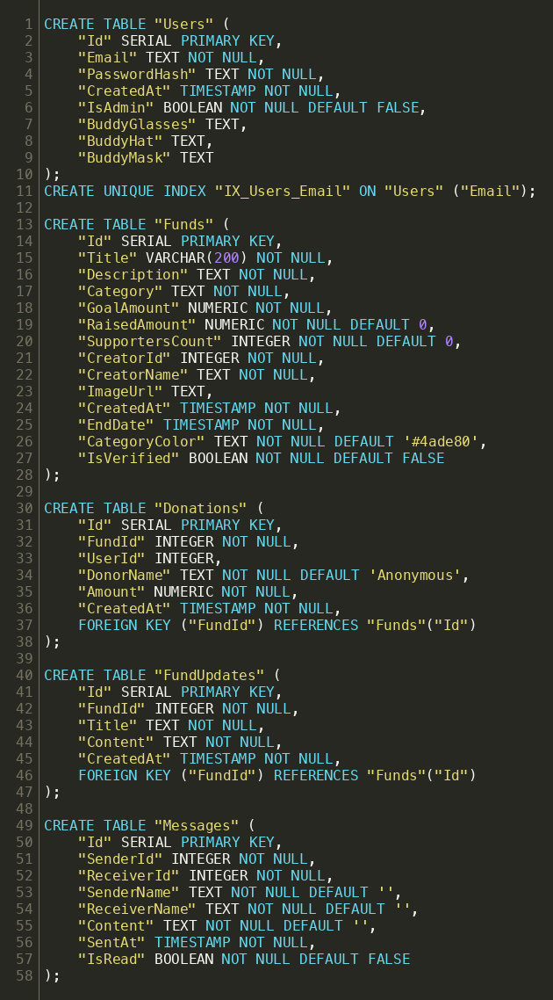

**Фигура 18 – SQL схема на основните таблици в PostgreSQL**

## Приложение В: Списък с категории кампании

Платформата KryskataFund поддържа осем основни категории на кампании, всяка с присвоен характерен цвят за визуално разграничаване. Категориите и техните цветове са представени в Таблица 5:

| Категория | Български превод | HEX цвят |
|-----------|-------------------|---------|
| Education | Образование | #3b82f6 |
| Health | Здраве | #ef4444 |
| Animals | Животни | #f97316 |
| Creative | Творчески | #a855f7 |
| Dreams | Мечти | #ec4899 |
| Just for fun | Просто за забавление | #facc15 |
| Technology | Технологии | #06b6d4 |
| Community | Общност | #4ade80 |

**Таблица 5 – Категории кампании и техните цветове**

Тази палитра от категории е достатъчно широка, за да обхване повечето типове крауфъндинг кампании, и в същото време достатъчно фокусирана, за да не обърква потребителите с прекалено много опции.

## Приложение Г: Имена на основните файлове и тяхното предназначение

`Program.cs` е централният файл на приложението, който конфигурира услугите и стартира уеб сървъра. `ApplicationDbContext.cs` е класът, който описва структурата на базата данни и предоставя достъп до отделните DbSet-ове. Файловете в `Migrations/` отразяват промените във времето в схемата на базата данни. Файлът `kryskatafund.css` в `wwwroot/css/` съдържа всички CSS стилове на приложението, включително тъмната тема, анимациите и responsive правилата. Файловете `.cshtml` в `Views/` описват визуалното представяне на отделните страници. Файлът `_Layout.cshtml` в `Views/Shared/` съдържа общата структура на страниците (навигационна лента, footer, references към CSS и JS).

## Приложение Д: GitHub репозитори и команди за стартиране

Проектът се поддържа в публично GitHub репозитори, достъпно на адрес https://github.com/Kryskata-C/KryskataFund. В репозиторито присъстват пълната история на разработката, всички commit-и с описателни съобщения и детайлна README документация, която обяснява как да се стартира проектът локално.

Стандартните команди за работа с проекта са:

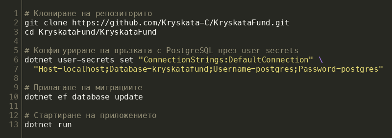

## Приложение Е: Известни бъдещи разширения

Списъкът на планираните бъдещи разширения включва: пълноценна интеграция с платежната система Stripe (началната интеграция вече присъства в Program.cs), нотификации чрез имейл при нови дарения и достигане на цели, социални функции като коментари и споделяне в социални мрежи, разширен административен панел, разширени статистики и графики чрез библиотеки като Chart.js или ApexCharts, многоезична поддръжка с превод на интерфейса, мобилно приложение за iOS и Android чрез .NET MAUI или React Native, поддръжка на множество валути, интеграция с външни услуги за автентикация (Google, Facebook, GitHub), система за модерация на съдържанието с machine learning за автоматично откриване на спам, и инструменти за анализ на ефективността на кампании с А/Б тестване на различни варианти на заглавия и описания.
